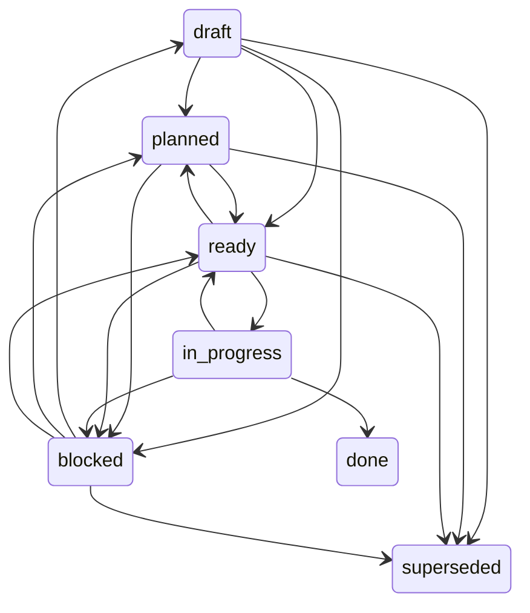
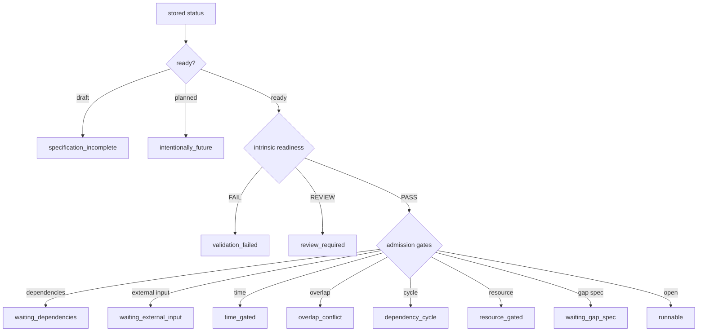

# Interactive Spec Creation Guide

**Purpose:** Use this document to walk a user (or agent) through creating a Nightshift spec step by step. Any LLM that can read files and have a conversation can follow this guide to help the user write a complete, well-formed spec.

**How to use:** An agent reads this guide, then asks the user a series of questions—one section at a time. After each answer, the agent fills in that section of the spec. At the end, the agent presents the complete spec for review and saves it to `specs/SPEC-XXX-short-title.md`.

**Works with:** Any LLM (Claude, GPT, Gemini, Llama, etc.) that can read markdown and conduct a conversation.

**Reference:** For the complete spec template and all sections, see `_TEMPLATE.md`. This guide references the template but does not duplicate its content.

**Template v4 rules (2026-04-16):** New specs must follow three quality rules codified via EVOLVE-007/008/009:
1. **`devkb_required:`** frontmatter is REQUIRED for `type: feature/bugfix/refactor` when stack is code. List the DevKB filenames the agent must read (e.g., `[python.md, architecture.md]`).
2. **Live Execution Checklist** section is REQUIRED for `type: feature` unless the change is a single-file CSS/text fix. Specs must trace the live execution path, not claim done on build + unit tests alone.
3. **`cortex_cites:`** frontmatter is OPTIONAL but encouraged. List Cortex entry IDs used as proof-of-research (e.g., `[#230, #240]`).
4. **`attachments:`** frontmatter is OPTIONAL for evidence artifacts. Use it for screenshots, annotated images, logs, videos, or data files that clarify expected vs actual behavior.

---

## Phase 0: Auto-Discovery (Agent Work)

Before asking the user any questions, the agent should:

1. **Read the project's `config.yaml`** to understand:
   - Project name
   - Primary languages
   - Domain (code, research, or analysis)
   - Build/test/lint conventions
   - Review personas that apply

2. **List existing specs** in `specs/` to determine:
   - What's the next available SPEC-XXX number?
   - What domains/layers are already covered?
   - What patterns exist in existing specs?

3. **Scan active NFRs** — read all `specs/NFR-*.md` files with `status: active`. Extract each `## Constraint` section and carry the full set into the spec interview. This step is mandatory — without it you cannot assess whether the new spec's requirements or ACs violate a standing quality constraint.
   - If no NFR files exist, note it and proceed.
   - Retired NFRs (`status: retired`) are skipped — they no longer apply.

4. **Summarize findings** to present to the user:
   ```
   "This is the Nightshift Kit for [project name].
   Domain: [code/research/analysis]
   Next available spec ID: SPEC-XXX

   Let me walk you through creating a new spec. We'll cover 9 phases, taking about 20-30 minutes total."
   ```

---

## Phase 1: Problem & Motivation

**Agent's Task:** Ask the user to articulate the problem and why it matters.

**Questions to ask:**

1. **"What problem are you trying to solve?"**
   - Expected answer: A concrete pain point, user frustration, or missing capability
   - Example: "Users can't search the document library. Currently they have to scroll through 500+ entries to find one document."

2. **"Why does this matter now? What's the trigger?"**
   - Expected answer: Business context, user feedback, deadline, blocker, or opportunity
   - Example: "We have 50 new users onboarding next week. Search is critical for them to be productive."

3. **"Who is affected? Who benefits from solving this?"**
   - Expected answer: User personas, teams, or stakeholders
   - Example: "Daily users and new onboarders. The support team also gets fewer 'How do I find X?' questions."

**Guardrails (Agent must enforce):**

- **If the answer is vague** ("make things better", "improve performance"):
  - Pushback: "That's too abstract. Can you give me a specific, concrete pain point? For example: 'Users spend 10+ minutes per day scrolling' or 'We lose customers because of slow load times.'"

- **If the answer describes a solution instead of a problem** ("add caching", "implement Redis"):
  - Pushback: "That sounds like a solution. Let's focus on the underlying problem. Why do you need a cache? What pain does it solve?"

- **If the answer has no time pressure or business justification**:
  - Pushback: "This sounds useful, but why now? Is there a deadline, user request, or blocker driving this?"

**After Phase 1:** Agent should be able to fill in the `## Problem` section of the spec template.

---

## Phase 2: Scope & Type

**Agent's Task:** Help the user define the scope and determine what kind of work this is.

**Questions to ask:**

1. **"Is this a new feature, a bug fix, a refactoring, or an evaluation task?"**
   - Expected answer: One of `feature`, `bugfix`, `refactor`, `eval`
   - Guide the user:
     - **Feature:** Something new the system doesn't do yet
     - **Bugfix:** Fixing broken behavior
     - **Refactor:** Improving existing code without changing behavior (performance, maintainability, tech debt)
     - **Eval:** Research or evaluation task (for research/analysis domains)

2. **"What layer does this belong in?"** (Explain layers first)
   ```
   Layers enforce a natural build order. All Layer 0 must be done before Layer 1, etc.
   - Layer 0: Foundation (project setup, core models, CI, static tools)
   - Layer 1: Infrastructure (logging, auth, API client, database layer, caching)
   - Layer 2: Features (user-facing features, search, profiles, notifications)
   - Layer 3: Polish (performance optimization, accessibility, analytics)
   ```
   - Expected answer: A number 0-3
   - Guide: "This helps us build in the right order. Dependencies before dependents."

3. **"Does this depend on any other specs being done first?"**
   - Expected answer: List of spec IDs (e.g., `[SPEC-001, SPEC-005]`) or "no"
   - Guide: "If this spec builds on top of another feature, list it here. The loop will respect the dependency."

**Guardrails (Agent must enforce):**

- **If the user describes something that sounds like 2-3 separate features** ("add search, add filters, and add sorting"):
  - Pushback: "This sounds like 3 features. Let's focus on the core — what's the minimum viable version? We can make filters and sorting separate specs later."

- **If the layer choice seems off** (e.g., a feature in Layer 0):
  - Suggest: "Layer 0 is for foundation only. Does this really belong there? Should this be Layer 2 (features)?"

- **If the type is unclear** ("kind of a bugfix, kind of a refactor"):
  - Clarify: "Let me ask differently. Is the system currently broken (bugfix) or does it work but just needs to be cleaner (refactor)?"

**After Phase 2:** Agent should have values for `type`, `layer`, and `after` in the frontmatter.

> **Vocabulary cross-link:** for the lifecycle, blocker semantics, and "done" criteria of non-code types (`nfr`, `research`, `analysis`), see `canonical/VOCABULARY.md`. That doc is also synced to every project as `.nightshift/VOCABULARY.md` and is required-read for sub-agents whose brief includes NFR injections or whose domain is non-code. Note also: "spike" (Agile sense) is not a separate type — it maps to `research` or `analysis`.

---

## Phase 3: Requirements

**Agent's Task:** Extract the specific, testable requirements that the agent needs to implement.

**Question to ask:**

1. **"What are the specific things the agent needs to build/produce?"**
   - Expected answer: A list of discrete, independently verifiable items
   - Say: "I'll ask you this differently based on your domain:"

**Domain-specific prompts:**

- **Code domain:**
  ```
  "What functions, endpoints, components, or modules need to exist?
  List each one as a clear statement:
  - Add a `/api/search` endpoint
  - Implement fuzzy-match algorithm
  - Add SearchBox component to UI
  etc."
  ```

- **Research domain:**
  ```
  "What output sections or deliverables are expected?
  For example:
  - Synthesize findings from 5+ sources
  - Write a summary of key trends
  - Create a recommendation section
  etc."
  ```

- **Analysis domain:**
  ```
  "What calculations or reports need to be produced?
  For example:
  - Calculate monthly transaction totals by category
  - Generate a CSV export with reconciliation checks
  - Cross-reference summary vs. detail totals
  etc."
  ```

**Guardrails (Agent must enforce):**

- **If requirements are vague** ("make search work", "improve the report"):
  - Pushback: "That's the goal, not a requirement. Be more specific. 'Make search work' — what does working mean? What features?"

- **If there are 5+ requirements covering unrelated areas**:
  - Suggestion: "This is a lot. Should we split this into 2-3 specs? Each spec should be focused on one area."

- **If a requirement is implementation-specific** ("use a B-tree index", "call the AWS API"):
  - Redirect: "That's an implementation detail. State the requirement instead: 'Search must work with 100K documents.' We'll let the agent decide how."

**After Phase 3:** Agent should be able to fill in the `## Requirements` section with a checked list of 2-5 items.

---

## Phase 4: Acceptance Criteria

**Agent's Task:** Extract concrete, testable criteria that prove the requirements work. This is the most critical phase.

**Say to the user:**

```
"For each requirement, what's the concrete test that proves it works?
These become the test cases. They must be specific and testable —
not vague like 'works well' or 'is fast', but measurable:
'returns results within 500ms', 'handles 100K items', etc."
```

**Then ask:**

1. **"For each requirement, what's the concrete test?"**
   - Expected answer: One or more acceptance criteria per requirement
   - Example for "add search box":
     - "User types in search box, results filter in real-time"
     - "Empty search returns all documents"
     - "Special characters don't crash the UI"

2. **"What edge cases should be handled?"**
   - Expected answer: Boundary conditions, error states, unusual inputs
   - Domain-specific prompts:
     - **Code:** "What happens with null input? Empty list? No authentication? Very large input? Special characters?"
     - **Research:** "What if a source is unavailable? What if claims contradict? What if there's insufficient data?"
     - **Analysis:** "What if data is missing? What if totals don't reconcile? What if there are duplicates?"

3. **"Are there any boundary values we should test?"**
   - Expected answer: Limits, thresholds, edge values
   - Examples: "0 items", "1 item", "1M items", "negative numbers", "future dates"

**Guardrails (Agent must STRICTLY enforce this phase):**

- **Reject vague acceptance criteria:**
  - ❌ "Search works well"
  - ❌ "Performance is good"
  - ✅ "Search returns results within 500ms for 100K documents"
  - ✅ "UI remains responsive (no > 1s freezes) during search"

- **Reject non-testable acceptance criteria:**
  - ❌ "Code is clean"
  - ❌ "User experience is smooth"
  - ✅ "All functions have docstrings"
  - ✅ "Lint passes with zero warnings"

- **Reject acceptance criteria without context:**
  - ❌ "Search works" (works how? How fast? With what data size?)
  - ✅ "Search returns results within 500ms for queries up to 100 chars on a 100K-document corpus"

- **Ensure edge cases are covered:**
  - If user only mentions happy path ("user types 'budget', sees results"):
    - Pushback: "Good. Now the unhappy paths: What if they type nothing? What if they type special characters? What if the query is 1000 characters long?"

- **Ensure each AC maps to at least one requirement:**
  - "We've listed 7 acceptance criteria. Which requirement does AC-6 belong to? I don't see a match."

**Checklist for Phase 4 (Agent must verify):**

- [ ] Each requirement has at least one AC
- [ ] Each AC is specific and measurable (not vague adjectives)
- [ ] Each AC is independently testable
- [ ] Edge cases are covered (null, empty, invalid, boundary, large)
- [ ] Domain-specific edge cases are included (auth, concurrency, duplicates, etc.)
- [ ] No AC is an implementation detail
- [ ] AC count is reasonable (2-3 per requirement, total 5-15)

**After Phase 4:** Agent should have a complete list of acceptance criteria that can be turned into test cases or validation checklists.

---

## Phase 5: Context & Constraints

**Agent's Task:** Gather background information, existing code/docs, and any limitations.

**Questions to ask:**

1. **"What existing code, files, or documentation should the agent look at?"**
   - Expected answer: File paths, module names, API docs, architecture guides
   - Examples:
     - "See `src/repositories/DocumentRepository.ts` for existing fetch patterns"
     - "API contract: GET `/api/documents/search?q=query`"
     - "See `knowledge/search-patterns.md` for project conventions"

2. **"Are there any constraints?" (performance, compatibility, dependencies, etc.)**
   - Expected answer: Hard limits or requirements
   - Examples:
     - "Search must be <500ms for 100K documents"
     - "Must work with PostgreSQL and MySQL"
     - "Cannot add external dependencies (no npm packages)"

3. **"Any known gotchas or pitfalls?"**
   - Expected answer: Things the agent should watch out for
   - Examples:
     - "Watch out for N+1 queries when fetching metadata"
     - "Previous attempts at search failed due to memory overhead with large datasets"
     - "This repository has strict lint rules — make sure to check early"

4. **"Are there attachments the agent should inspect?"**
   - Expected answer: Relative paths plus a short description of what each artifact shows
   - Examples:
     - `reports/ui/expected.png` — expected tab bar visible, Scan active
     - `reports/ui/actual.png` — current implementation missing the tab bar
     - `reports/ui/annotated.png` — one screenshot with multiple numbered issues
   - Add these to frontmatter `attachments:` as mappings with `path` and `description`.
     Optional fields: `kind` (`image`, `log`, `video`, `data`, `doc`, `other`) and
     `role` (`expected`, `actual`, `annotated`, `reference`, `evidence`).

**Guardrails (Agent must enforce):**

- **If context is too vague** ("look at the codebase"):
  - Pushback: "Be more specific. What files? What patterns should they follow? What conventions?"

- **If constraints are missing for non-trivial specs** (e.g., no performance requirement for a search feature):
  - Pushback: "You haven't mentioned performance. How fast should search be? Is there a timeout?"

- **If the user provides implementation details as context** ("use Redis for caching"):
  - Redirect: "That's implementation. The context should describe what the agent will find, not how to solve it."

**After Phase 5:** Agent should have values for `Context` section and understand what knowledge the agent will need.
If attachments exist, the agent should also have frontmatter `attachments:` and a short `## Attachments` body section.

---

## Phase 6: Scenarios (End-to-End)

**Agent's Task:** Extract end-to-end user journeys that describe complete workflows.

**Say to the user:**

```
"Scenarios are different from acceptance criteria. Instead of testing
individual conditions, scenarios test complete user journeys.
Walk me through what a real user does, step by step."
```

**Then ask:**

1. **"Describe a complete, happy-path user journey:"**
   - Expected answer: "User does X → sees Y → does Z → sees result"
   - Example: "User opens document list → types 'budget' in search → sees 3 matching docs → clicks first → document opens"

2. **"Now describe an edge-case or error scenario:"**
   - Expected answer: "User encounters [unusual state] → system responds with [graceful behavior]"
   - Example: "User searches while offline → sees cached results with 'last updated 2h ago' banner → reconnects → results refresh"

3. **"Any other scenarios?"**
   - Expected answer: Key user flows that validate the feature works end-to-end
   - Aim for 2-4 scenarios total

**Guardrails (Agent must enforce):**

- **If scenarios are too granular** (testing single conditions like "button is visible"):
  - Redirect: "That's too micro. I need user journeys — start to finish. What does the user do, and what do they see?"

- **If scenarios are missing error cases:**
  - Pushback: "Good happy path. Now what if something goes wrong? Network failure? Invalid input? Rate limit?"

- **If scenarios duplicate acceptance criteria exactly:**
  - Note: "Scenarios validate the whole flow. They can reference ACs but should test integration, not individual conditions."

**After Phase 6:** Agent should have 2-4 end-to-end scenarios that describe complete user workflows.

---

## Phase 7: Out of Scope

**Agent's Task:** Clarify what's explicitly NOT being done in this spec.

**Question to ask:**

1. **"What are you explicitly NOT including in this spec?"**
   - Expected answer: Related features or enhancements that are deliberate exclusions
   - Examples:
     - "Advanced filters (by date, author, tag) — future spec"
     - "Autocomplete/suggestions — not in MVP"
     - "Search history — out of scope"

2. **"Any related features that should be separate specs later?"**
   - Expected answer: Follow-on work that could be specs in a future layer
   - Example: "We'll do basic search in this spec, then fuzzy-match in SPEC-XXX, then advanced filters in SPEC-YYY"

**Guardrails (Agent must enforce):**

- **If "out of scope" is vague** ("we won't do everything"):
  - Pushback: "Be specific. What features or requirements are we leaving out?"

- **If scope creep is visible** ("and also filters, and also sorting, and also saved searches"):
  - Redirect: "Those are all good ideas. Let's list them as 'out of scope for this spec' and create separate specs for them. This keeps scope tight."

**After Phase 7:** Agent should have a clear list of what's NOT being done, which prevents scope creep during implementation.

---

## Phase 8: Optional Sections

**Agent's Task:** Check for optional but high-value sections.

**Ask:**

1. **"Have there been previous attempts at solving this problem?"**
   - If yes: "What happened? Why did they fail? What should the agent learn?"
   - Use this to fill `prior_attempts` in frontmatter and `Alternatives Considered` section
   - **SPEC-046 note (2026-04-16):** from this spec forward, the retry loop
     automatically appends a structured entry to `prior_attempts:` every time
     it decides to retry. This is forward-only — retries that happened before
     SPEC-046 landed will NOT be reflected in existing specs. If you need to
     seed history from a prior investigation, add entries manually in the same
     shape the loop writes: `{attempt, date, session_id, outcome, events, failure_hint}`.
     Specs that run many times by design (e.g., `eval-specs/`) can opt out with
     `prior_attempts_tracking: false` in frontmatter.

2. **"Is there an exemplar (working implementation of something similar) the agent should study?"**
   - If yes: "What's the source? What patterns should they learn? What should they NOT copy?"
   - Use this to fill `Exemplar` section

3. **"Any final notes or clarifications for the agent?"**
   - Use this to fill `Notes for the Agent` section

**After Phase 8:** Agent has gathered all remaining context.

---

## Phase 9: Review & Output

**Agent's Task:** Present the complete spec, validate it against a checklist, and save it.

### Material REVIEW decisions and reuse gate

An unresolved item is not automatically `blocked`. If intrinsic readiness returns
`REVIEW`, use the existing `/nightshift address-issues` QUESTIONS flow. A full evidence
brief is required only when the explicit question can materially change requirements,
ACs, architecture, execution authority, safety, or meaningful cost. Ordinary dependency
waiting, deliberately `planned` work, deterministic repairs, and advisory questions use
the lightweight question path.

For a material decision, the QUESTIONS entry must retain a timestamped decision brief:
one precise question; measured facts; reproducible commands/queries and resolvable
evidence; viable options (including newly measured ones); consequences/cost/risk/
reversibility; recommendation and reasoning; assumptions/unknowns; neighbouring
questions not decided; and proposed authority. A deterministic gate validates this shape;
an independent reviewer assesses relevance, sufficiency, completeness, and inference.
The coordinator owns reconciliation, authority routing, and serial writeback; evidence
workers are bounded/read-only and run agents receive only the compact resolved packet.

Before proposing a new command, ledger, store, autonomy rule, validator, or packet
mechanism, inventory the existing `address-issues`, QUESTIONS, validation, autonomy, and
instruction-packet primitives. A new mechanism needs a named measurable gap, a smaller
reuse-based alternative considered, and an AC that proves the addition closes that gap
without duplicating authority or storage. Do not propose a parallel decision command or
store merely to make a brief easier to describe.

**Steps:**

1. **Present the complete spec to the user:**
   ```
   "Here's the complete spec. Please review it for clarity and accuracy.
   I'll also run it against a quality checklist."
   ```

2. **Run the checklist from `_TEMPLATE.md` → "Checklist Before Marking as Ready":**
   - [ ] Problem and context are clear
   - [ ] Requirements map to acceptance criteria
   - [ ] Acceptance criteria are specific and testable
   - [ ] Layer and priority are reasonable
   - [ ] Out of scope is clear
   - [ ] Soft dependencies are noted
   - [ ] Prior attempts are listed
   - [ ] Alternatives considered are filled
   - [ ] Scenarios describe end-to-end journeys
   - [ ] Exemplar is linked (if available)
   - [ ] Attachments are listed when visual/log/data evidence is needed
   - [ ] NFR reconciliation is clean — run `python3 audit_nfr.py --check-all --specs-dir specs/`; bind every match in `nfrs:` or record `nfr_waivers: [{id, reason}]`
   - [ ] Someone reviewed the spec (the agent did; human should too)

3. **Flag any weaknesses:**
   - If AC-3 is vague, flag it: "AC-3 is a bit vague — should we tighten it to: 'search returns results within 500ms'?"
   - If layer seems wrong: "This feels like Layer 2 (feature), not Layer 1 (infra). Should we move it?"
   - If requirements don't match acceptance criteria: "We have 5 requirements but only 3 ACs. Each requirement should have at least one AC."

4. **Ask for approval:**
   ```
   "Ready to save? I'll write this to:
   specs/SPEC-XXX-short-title.md
   with status: ready

   Should I proceed, or make any changes first?"
   ```

5. **After approval, save the spec:**
   - Write the complete spec to `specs/SPEC-XXX-short-title.md`
   - Set frontmatter fields:
     - `id: SPEC-XXX`
     - `priority: [1-10, default 5]` ← Ask user if not specified
     - `layer: [0-3]` ← Should be filled from Phase 2
     - `type: [...]` ← From Phase 2 — see § Spec Types for all valid values
     - `status: ready` ← Ready to enter the loop
     - `after: [list of spec IDs]` ← From Phase 2
     - `provides: []` ← Optional capability markers this spec creates (SPEC-054)
     - `requires: []` ← Optional capability markers this spec needs; advisory unless paired with `after:`
     - `touches: []` ← Optional advisory files/capabilities for overlap warnings
     - `attachments: []` ← Optional evidence artifacts; each item needs `path` and `description`
     - `prior_attempts: []` ← From Phase 8
     - `created: [YYYY-MM-DD]` ← Today's date

6. **Confirm successful save:**
   ```
   "✅ Spec saved to specs/SPEC-XXX-short-title.md

   This spec is ready for the Nightshift loop. An agent can now pick it up
   and begin implementation. The loop will follow LOOP.md and use your
   acceptance criteria as the definition of done."
   ```

---

## Stacking Metadata

Optional fields `provides`, `requires`, and `touches` help the board/orchestrator explain sequencing without replacing `after:`. `after:` remains the only hard dependency source. `requires` warnings tell an agent that a capability provider is missing or should probably be declared as a hard dependency. `touches` warnings prevent unsafe parallel work when two ready specs edit the same protocol file or capability.

## Attachment Metadata

Optional frontmatter `attachments:` gives tools and agents structured references
to screenshots, logs, videos, data files, or documents that clarify the spec.
It is especially useful for UI bugs where one image shows the expected state,
another shows the actual buggy state, or an annotated image calls out multiple
issues.

```yaml
attachments:
  - path: reports/ui/expected.png
    kind: image
    role: expected
    description: Correct state from the handoff; tab bar is visible.
  - path: reports/ui/actual.png
    kind: image
    role: actual
    description: Current implementation; tab bar is missing.
  - path: reports/ui/annotated.png
    kind: image
    role: annotated
    description: One screenshot with numbered callouts for several issues.
```

Rules:
- `path` is required and must be relative to the project root.
- `description` is required and should say what the artifact proves or shows.
- `kind` is optional: `image`, `log`, `video`, `data`, `doc`, or `other`.
- `role` is optional: `expected`, `actual`, `annotated`, `reference`, or `evidence`.
- Put long explanations in the `## Attachments` body section; keep YAML short.

---

## ID Assignment Rules

### Never assign a spec ID manually

Spec IDs must be generated by `check_followup_spec.py` — never by scanning specs
and incrementing manually. The script performs two guarantees that manual
assignment cannot:

1. **Title-similarity conflict check** — detects duplicate work before the ID is reserved.
2. **Existence check** — verifies the candidate ID is not already in use, even
   across follow-up streams from different parents.

For any new spec (follow-up, manually created, or baseline), run:

```bash
python3 .nightshift/check_followup_spec.py \
  --suggestion-title "Short title of the new spec" \
  --specs-dir .nightshift/specs/ \
  [--parent-id SPEC-004]     # Include when the spec is a child of an existing spec
  [--domain be]              # Optional: domain hint (ds/ui/net/be/watch/arch/test/infra/misc)
  [--layer 2]                # Optional: used for informational cluster notes
```

Use the `proposed_id` from the JSON output as the spec's `id:` field.

### Parent-scoped IDs prevent cross-stream collisions

When two independent follow-up streams from different parent specs both generate
sequential IDs, they can collide on the same number (e.g., two parents both
produce a third child and both land on `-044`).

The fix: pass `--parent-id PARENT` to scope the child ID to that parent:

| Without parent-id | With --parent-id SPEC-030 |
|---|---|
| `SPEC-NNN` (global counter) | `SPEC-030-NNN` (parent-scoped) |
| Can collide across streams | Structurally collision-free |

When a spec has a `parent:` field in its frontmatter, always pass that parent's
ID as `--parent-id` when generating the child's ID.

### File naming

Save as `specs/{proposed_id}-short-title.md` — the ID must appear at the start
of the filename so board tools can parse it without reading frontmatter.

---

## Creating an NFR Spec

NFR specs are created with `type: nfr` using `_TEMPLATE-NFR.md`. They do not go through the 9-phase interview — they define standing quality constraints, not tasks.

**After saving a new NFR**, run the impact audit to identify existing non-done specs that may fall within the NFR's scope:

```bash
python3 .nightshift/audit_nfr.py \
  --nfr-id NFR-XXX \
  --specs-dir .nightshift/specs/
```

The acting agent MUST reconcile every matched non-done spec: add the NFR ID (or
its top-level parent) to `nfrs:`, or add an explicit `nfr_waivers:` mapping with
a non-empty reason. The audit never auto-edits specs, but reconciliation is not
optional. Run `python3 audit_nfr.py --check-all --specs-dir specs/` before
promotion or CI to prove the corpus is clean.

The audit matches non-done specs by:
- `domain:` field value appearing in the NFR's `scope_tags`
- `layer-N` indicator appearing in `scope_tags`
- Any token from `touches:` intersecting `scope_tags`
- If the NFR has no `scope_tags`, all non-done specs are returned (conservative)

**`scope_tags` on NFRs:** Use lowercase strings matching the project's domain names (`ui`, `be`, `ds`), layer indicators (`layer-0`…`layer-3`), and tech keywords (`swiftui`, `auth`, `database`). Empty `scope_tags` means "applies everywhere."

### NFR reconciliation transition gate

| Transition | Mandatory preconditions |
|---|---|
| `draft → planned` / `draft → ready` | The same intrinsic PASS gate: `nfrs:` present, every active-NFR mechanical match bound or waived, declared `after:` references valid. `planned` is intentionally future; `ready` is current priority. |
| `ready → in_progress` | Derived admission is `runnable`; dependency, time, resource and expected-input waits keep the stored lifecycle state unchanged. |
| `* → blocked` | Demonstrated critical constraint plus blocker_class, reason, since, unblock condition, scope and evidence; ordinary waits are invalid blockers. |
| `done` | Existing completed specs are not retroactively re-gated |

The labels below are registry terms; the edges are mechanically checked against
`lifecycle.LIFECYCLE_TRANSITIONS` and the derived states against
`lifecycle.RUN_STATES`.





When promoting an individual spec to `ready`, reconcile it against every active
NFR first. When creating an NFR, reconcile it in the opposite direction against
every matched non-done spec. This is the canonical rule referenced by the
orchestrator and `/nightshift` flows.

---

## Spec Types

Canonical registry for all valid `type:` values across all Nightshift templates.
This is the single source of truth — templates reference this section instead of
listing values inline.

### Core code types (`_TEMPLATE.md`)

| Value | When to use |
|-------|-------------|
| `feature` | New capability the system does not have yet |
| `bugfix` | Fixing broken behaviour that violates an existing spec's AC — use `_TEMPLATE-BUGFIX.md` |
| `refactor` | Improving existing code without changing user-visible behaviour |
| `eval` | Time-boxed investigation or proof-of-concept |
| `nfr` | Non-functional requirement: standing quality constraint with no done or blocked state — use `_TEMPLATE-NFR.md` |
| `main` | Parent spec grouping sub-specs; never executed directly by the loop |

### Research types (`_TEMPLATE-RESEARCH.md`)

| Value | When to use |
|-------|-------------|
| `research` | Open-ended investigation with a synthesis deliverable |
| `distillation` | Condensing multiple sources into a structured summary |
| `fact-check` | Verifying specific claims against authoritative sources |
| `review` | Structured evaluation of a document, codebase, or approach |

### Analysis types (`_TEMPLATE-ANALYSIS.md`)

| Value | When to use |
|-------|-------------|
| `analysis` | Data processing with quantitative output |
| `reconciliation` | Cross-referencing two or more data sources for discrepancies |
| `valuation` | Calculating the value of an asset or position |
| `scoring` | Computing a score or ranking across a data set |
| `report` | Generating a structured output from raw data |

### Utility types (project-local, no canonical template)

| Value | When to use |
|-------|-------------|
| `questions` | Consolidated tracker for open questions gathered from specs or run reports |

### Rules

- `bugfix` must use `_TEMPLATE-BUGFIX.md` — requires the `violates:` field.
- `nfr` must use `_TEMPLATE-NFR.md` — the loop never picks nfr specs as executable work.
- Any spec whose `id` starts with `NFR-` is NFR-family even if the dated run
  uses another type such as `task`; NFR-family specs use only `status: active`
  or `status: retired`.
- Failed or unavailable NFR verification is recorded in the NFR body. It blocks
  the triggering executable spec or creates/links a violation bug with
  `violates: [NFR-001]`; it never marks the NFR spec `blocked`.
- Research types must use `_TEMPLATE-RESEARCH.md`; analysis types must use `_TEMPLATE-ANALYSIS.md`.
- The loop selects `bugfix` specs before `feature` specs of equal layer and priority.
- `main` specs are never executed directly — the orchestrator fans out to their children.
- If a project needs a type not listed here, use the nearest match or open a spec to propose a new canonical entry.

---

## Anti-Patterns Reference

Use this table to catch common spec mistakes and redirect:

| Anti-Pattern | Example | How Agent Should Fix |
|---|---|---|
| **Solution disguised as problem** | "We need to add Redis" | "What latency problem are you solving? Let's focus on the problem, not the solution." |
| **Vague acceptance criteria** | "Search works well" | "Too vague. How fast? How many results? What data size? Be specific and measurable." |
| **Scope creep baked in** | 10+ requirements covering 3 different features | "This is really 2-3 specs. Let's split: foundation spec, then feature spec, then polish spec." |
| **Implementation details in spec** | "Use a B-tree index on the name column" | "That's how you'd solve it. State the requirement instead: 'Search by name must be fast (<200ms).'" |
| **Missing edge cases** | Only happy path tested | "Good happy path. Now: what happens with null input? Empty data? Huge input? Errors?" |
| **Untestable requirements** | "Code should be clean" | "That's not testable. How do you measure it? 'All functions have docstrings'? 'Lint passes'? Be concrete." |
| **No priority or layer** | Spec written but layer/priority blank | "Which layer (0-3)? What priority (1-10)? These help the loop build in order." |
| **Dependencies not declared** | Spec depends on SPEC-002 but doesn't say so | "Does this depend on another spec? If so, list it in `after:` so the loop knows the order." |
| **No way to verify completion** | "Implement user authentication" with vague ACs | "How will the agent know when auth is done? What tests pass? Write concrete ACs." |
| **Too large for one spec** | 50+ lines, 8+ requirements, 3 different layers | "This is too big. Split it. Nightshift specs should be 1-2 days of work max per spec." |

---

## Domain-Specific Guidance

### For Code Domain:

- **Phase 3 (Requirements):** Focus on components, endpoints, functions that need to exist
- **Phase 4 (AC):** Emphasize unit tests, integration tests, edge cases with type errors, null handling, concurrency
- **Phase 5 (Context):** Point agent to relevant modules, existing patterns, performance budgets
- **Phase 6 (Scenarios):** Describe user-facing workflows and API interactions
- **Out of Scope:** Often includes "performance optimization", "refactoring", "documentation" — separate concerns

### For Research Domain:

- **Phase 3 (Requirements):** Focus on research questions, deliverable sections (summary, findings, recommendations)
- **Phase 4 (AC):** Emphasize source verification, fact-checking, citation completeness, bias detection
- **Phase 5 (Context):** Point agent to available sources (APIs, databases, articles), citation format requirements
- **Phase 6 (Scenarios):** Describe how the output answers the research question
- **Out of Scope:** Often includes "peer review", "publication", "further analysis" — separate concerns

### For Analysis Domain:

- **Phase 3 (Requirements):** Focus on calculations, reports, data transformations, aggregations
- **Phase 4 (AC):** Emphasize calculation correctness, cross-reference reconciliation, boundary conditions (zero, negative, missing data)
- **Phase 5 (Context):** Point agent to data sources, data dictionary, calculation formulas
- **Phase 6 (Scenarios):** Describe how output is used and what it proves
- **Out of Scope:** Often includes "visualization", "predictive modeling", "data cleaning" — separate concerns

---

## Using This Guide

### For Agents:

1. **Read this guide in full** before starting any conversation with a user
2. **Follow the 9 phases in order** — don't skip ahead
3. **Use guardrails strictly** — catch vague specs before they cause wasted work during implementation
4. **Enforce the Anti-Patterns table** — these are real mistakes that slow down the loop
5. **At Phase 9, validate against the checklist** — a strong spec saves tokens

### For Humans (Users):

1. **Find an agent** that can read markdown and conduct a conversation
2. **Give the agent this guide:** "Read this and walk me through creating a spec"
3. **Be ready to answer 9 questions** — budget 20-30 minutes
4. **Expect pushback** if your answers are vague — that's the guardrails working
5. **Review the final spec carefully** — this is the contract between you and the agent that will build it

---

## Portable Path Variables (SPEC-071)

Stored Nightshift artifacts must **not** hold absolute host paths. A path generated in
one environment (e.g. a Cowork Linux VM, `/sessions/.../mnt/Argo/Cortex`) is wrong when
read in another (the owner's Mac, `/Users/ed/Dropbox/Argo/Cortex`), or inside a git
worktree under `.claude/worktrees/`. Instead, write **portable path tokens** that resolve
to the real path at read time, per environment.

### Token grammar

Two namespaces, distinguished by case (this is a **documentation convention**, not a
parser-enforced rule — safety comes from a separate resolution pass, not from casing):

- **`UPPER_SNAKE` — path/env anchors.** Exactly three, resolved by `canonical/path_vars.py`:
  - `{{PROJECT_ROOT}}` — parent of the spec's nearest-enclosing `.nightshift/`.
  - `{{ARGO_HOME}}` — Argo Home root (resolved via `$ARGO_HOME`, else a `session.md`
    marker walk-up, else fail-closed in execute mode).
  - `{{HOME}}` — the user's home directory (lowest priority; strips username on export but
    gives no cross-environment portability for non-project files).
- **`lower_snake` — prompt variables** owned by `prompt_engine` (e.g. `{{spec_content}}`).
  Never write a `lower_snake` token expecting a path; it is filled at prompt-assembly time.

The most-specific anchor wins: a path under `{{ARGO_HOME}}` tokenizes against it, **not**
`{{HOME}}`, even though HOME is a path-prefix of ARGO_HOME.

### Cross-project references route by NAME, not path arithmetic

Never write `{{PROJECT_ROOT}}/../OtherProject/...`. The validator rejects `..` traversal
past `PROJECT_ROOT`. To reference another project's spec, use the cross-project registry
(by spec **name**) — the board's external-spec navigation (SPEC-064) resolves it.

### Escaping a literal token

Code spans and fenced code blocks are the **only** literal-token escape. A token in
backticks (`` `{{PROJECT_ROOT}}` ``) or inside a ```` ``` ```` / `~~~` fence is rendered
verbatim — the resolver, the migration tool, and the validator all skip code spans. There
is no backslash escape grammar.

### Resolution policy (for tool authors)

`path_vars.resolve(text, root, *, mode)` takes an **explicit** `root` (no process-global
default):

- `mode='execute'` — fail-**closed**: any unresolvable UPPER token raises `ResolutionError`
  before *any* substitution. Never empty-substitutes or partial-resolves. Use this when the
  resolved path is fed to a subprocess / file open.
- `mode='display'` — fail-**open**: leaves the literal `{{TOKEN}}` untouched. Use this for
  UI rendering where a literal token is acceptable.

The `SpecCache` stores **raw** token-bearing text; resolution is a separate **egress** step
on the consumer side. The loop resolves a spec body *before* injecting it as the
`{{spec_content}}` prompt variable, so no path token ever reaches `prompt_engine`.

### Migration & rollout (R12 ordering)

- **New prose:** write tokens directly. **Existing prose:** run the one-shot migration
  `python3 canonical/migrate_paths.py <specs-dir>` (dry-run by default; `--apply` to write).
  It is idempotent, skips code fences, and **aborts inside a linked worktree** — run it on
  the **main** checkout only.
- **Registries** are tokenized at *generation* time by `nightshift-sync.py` — never
  hand-migrate `projects-registry.json`.
- **Rollout order:** sync the resolver + updated `validate_specs.py` first, **restart all
  long-running boards/master** (they cache the old code), then regenerate registries
  (tokenized) **last**. A token-bearing registry read by a not-yet-restarted board shows a
  literal `{{...}}` in its UI for a short window — this is acceptable and non-corrupting,
  not breakage.

---

## Notes on Implementation

- **Flexibility:** Agents may ask questions in different order or combine phases — that's fine as long as all 9 phases are covered
- **Iteration:** Users may change their minds. Let them revise answers. Specs evolve during the conversation
- **Blocking:** If a user can't answer a phase clearly, don't proceed. Ask for clarification or suggest they come back when ready
- **Timing:** A well-conducted spec conversation takes 20-30 minutes. If it's taking 2+ hours, the problem may be too large (scope creep) or too vague (needs more research)

---

> **A well-written spec is the difference between smooth execution and frustrating back-and-forth.**
>
> This guide exists to prevent the latter.
