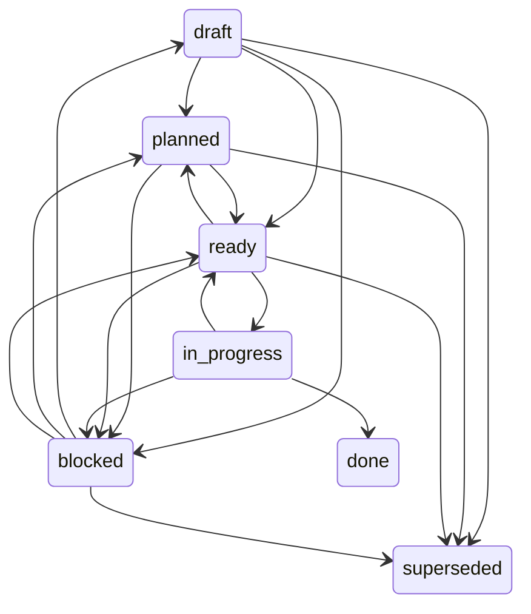
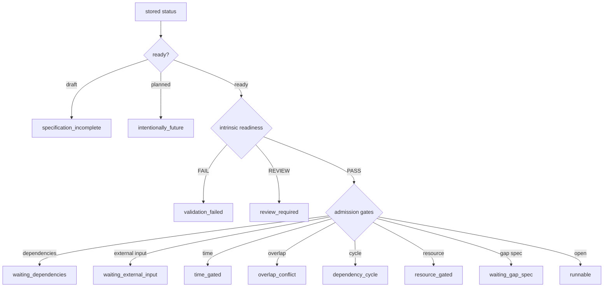
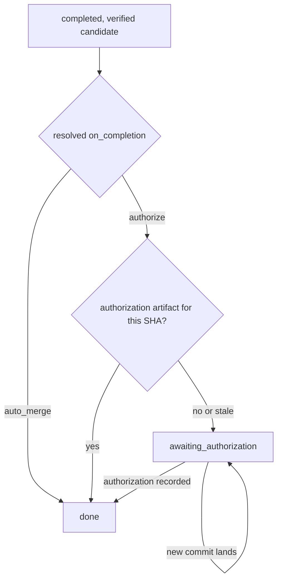

# Interactive Spec Creation Guide

Canonical-source implementation specs must declare explicit `scope.write` on
main and follow GIT.md's receipt-bound authoring contract (SPEC-365). A spec or
worker cannot grant its own exception: the parent retains authorization, original
receipt, admitted baseline, approved scope and exact candidate/main bindings and
injects `authoring_provider` through the official acceptance seam. Bootstrap
requires independent verification and external authorization; missing proof stops
acceptance/lifecycle/merge/cleanup. Installed copies remain strict and release
handoffs stay pending until an independently authorized whole-kit rollout.

**Purpose:** Use this document to walk a user (or agent) through creating a Nightshift spec step by step. Any LLM that can read files and have a conversation can follow this guide to help the user write a complete, well-formed spec.

**How to use:** An agent reads this guide, then asks the user a series of questions—one section at a time. After each answer, the agent fills in that section of the spec. At the end, the agent presents the complete spec for review and saves it to `specs/SPEC-XXX-short-title.md`.

**Works with:** Any LLM (Claude, GPT, Gemini, Llama, etc.) that can read markdown and conduct a conversation.

**Reference:** For the complete spec template and all sections, see `_TEMPLATE.md`. This guide references the template but does not duplicate its content.

**Public-project artifact migration (SPEC-191):** Treat tracked reports,
metrics, knowledge, checkpoints, and run artifacts as a migration concern, not
a release-copy concern. Run `observability_enroll.py audit` first, review its
path classifications, then migrate the hash-verified private copy before
explicitly approving any future-index cleanup. Never infer authority for a
history rewrite: `history-remediation` is a separate dry-run-first operator
operation with ref inventory and post-rewrite leak evidence.

**Release handoff (SPEC-189):** When a spec changes a managed canonical protocol,
runtime helper, schema, hook, config reference, or synced skill, add
`release_handoff: {impact: required}` and create the matching portable
`release-handoffs/<SPEC-ID>.json` artifact. Documentation-only or non-managed
work must instead record `impact: exempt` with a reason. Author a required
artifact with `manifest_fingerprint:
"pending-release-manifest-fingerprint-v1"` and the spec's declared target
version; never guess a real fingerprint. The release coordinator alone
mechanically replaces that sentinel and target version with the actual manifest
immediately before delivery validation. A raw sentinel or any other mismatched
fingerprint cannot complete. A release-impact spec cannot become `done` until
the artifact validates; only `/nightshift release` can fulfil its pending
handoff after the full managed-kit rollout.

**Declaration policy for terminal non-delivering specs (SPEC-271):** A
`release_handoff:` declaration describes a spec's intent while it was live,
not a live obligation once the spec stops moving. The terminal
non-delivering status set is derived structurally from
`lifecycle.LIFECYCLE_TRANSITIONS` (via `lifecycle.terminal_statuses()`):
every status with no outgoing transition, minus `done` (which is delivering
by definition and stays fully gated). That leaves exactly `{superseded}` —
the only status that is both terminal and non-delivering. Once a spec
reaches `superseded`, its `impact: required` declaration stops producing an
unclearable "release-impact spec requires a release handoff artifact"
finding; this is the default outcome, requiring no action, and the
declaration is left byte-unchanged. Re-classifying that declaration (e.g.
`required` → `exempt` with a `reason`) is never a side effect of the status
transition itself — it requires the dedicated
`release_handoff.reclassify_terminal_declaration` function, which refuses to
run on a non-`superseded` spec, refuses an empty reason, and records a
durable checkpoint distinct from any status-transition commit.

**Delivered but not closed (SPEC-332):** A release-handoff record at
`status: completed` means the spec shipped, so a spec status other than
`done` on that same spec is a record inconsistency that
`delivered_but_not_closed_findings` flags; fix it by closing the spec or
retiring the handoff.

**Historical checkbox dispositions (SPEC-204):** A project that has deliberately
preserved unchecked Requirements or Acceptance Criteria in historical `done`
specs may keep an optional project-owned evidence file at
`.nightshift/historical-checkbox-status-dispositions.json`. It is not part of the
managed kit or release manifest. Its schema is:

```json
{
  "entries": {
    "SPEC-001-example.md": {
      "disposition": "intentional_historical_record",
      "findings": [
        {
          "line": 42,
          "section": "Requirements",
          "text": "- [ ] Historical requirement text"
        }
      ]
    }
  }
}
```

The only dispositions are `intentional_historical_record` and
`unresolved_evidence_gap`. The filename key and the ordered `findings` list must
exactly match every current unchecked item by line, section, and checkbox text.
An exact match emits a visible warning, including the disposition and count; it
never checks an item or claims implementation. An absent, malformed, partial,
stale, reordered, or unknown-disposition entry retains the ordinary errors.
Finding drift therefore requires a fresh explicit review and disposition. Tools
must not generate, renew, or silently rebaseline this evidence.

**Template v4 rules (2026-04-16):** New specs must follow three quality rules codified via EVOLVE-007/008/009:
1. **`devkb_required:`** frontmatter is REQUIRED for `type: feature/bugfix/refactor` when stack is code. List the DevKB filenames the agent must read (e.g., `[python.md, architecture.md]`).
2. **Live Execution Checklist** section is REQUIRED for `type: feature` unless the change is a single-file CSS/text fix. Specs must trace the live execution path, not claim done on build + unit tests alone.
3. **`cortex_cites:`** frontmatter is OPTIONAL but encouraged. List Cortex entry IDs used as proof-of-research (e.g., `[#230, #240]`).
4. **`attachments:`** frontmatter is OPTIONAL for evidence artifacts. Use it for screenshots, annotated images, logs, videos, or data files that clarify expected vs actual behavior.

**Real-use evidence (SPEC-238):** A feature must declare one of
`required_before_done`, `delegated_experiment`, or narrowly reasoned
`not_applicable` in `real_use_evidence`. Prefer a falsifiable adoption,
effectiveness, or reliability hypothesis preregistered before its first eligible
event. A delegated unchecked `LE<n>` must map exactly once to a tracked experiment
descriptor, its hypothesis IDs, a completed instrumentation spec, and immutable
SPEC-236 lineage. This permits the delivery spec to close while the experiment is
visibly registered or collecting. It never permits delegation of Requirements,
Acceptance Criteria, active NFRs, destructive-operation safety, privacy,
compatibility, or release proof. Zero observations are `no_samples` with a null
value, never success; later unsupported evidence creates linked remediation and
does not rewrite the source spec's historical status.

**Live Execution evidence references (BUG-023, template v11+):** a checked
`- [x] **LEn:**` box is not, by itself, proof that the live execution
happened — it is checkbox text. For specs with `template_version >= 11` and
`real_use_evidence.policy: required_before_done`, every checked LE item at
`status: done` must carry an inline `(evidence: <path>)` reference on the same
line, and that path must resolve to a real file relative to the spec file's
directory or its parent (the kit/canonical root) — a safe relative path only,
no absolute paths, `~`, `..`, or URLs. Example:

```markdown
- [x] **LE1:** Executed 2026-09-06 via BUG-023 (evidence: reports/BUG-023/live-run.md)
```

Existence is sufficient — no cryptographic hash is required (that asymmetry
with `delegated_experiment`'s `lineage_hash` requirement is intentional: this
closes the "checked with zero backing evidence" gap, not the gap between the
two policies' evidentiary weight). A checked item missing a valid reference is
a validation ERROR naming the LE id. Specs with `template_version` below 11 (or
absent) are grandfathered — this requirement was introduced without a corpus
backfill; existing `done` specs are not retroactively invalidated. Once a spec
adopts `template_version: 11` it is fully subject to the requirement, so do
not bump `template_version` on an already-`done` spec without also adding real
evidence references to its checked LE items.

---

## Intent capture (optional pre-Phase-0)

When the user has a half-formed idea and is not ready to commit to spec work,
offer a lightweight intent capture before starting Phase 0. Ask only for the
problem, trigger, who is affected, and rough outcome. Write the answers to
`intents/<lowercase-kebab-slug>.md` using `intents/_TEMPLATE-INTENT.md`
(`canonical/intents/` in this repository and `.nightshift/intents/` in an
installed kit). The file is git-tracked, human-reviewable, non-committing, and
deliberately outside `specs/`; it is never runnable, board-visible, or
evidence that implementation has a spec.

An intent never weakens or substitutes for the nine-phase interview:
**interview guardrails apply in full to every spec regardless of intent origin**.
When a user later brings an intent to the full interview, use
`problem`, `trigger`, and `affected` only to pre-fill Phase 1 and
`rough_outcome` as initial scope context. Confirm every value with the user
rather than silently accepting it, then run all phases normally. The
resulting spec's `## Context` records `Origin intent: intents/<slug>.md`;
update the intent to `status: promoted` and `promoted_to: <SPEC-ID>` only
after the spec exists.

Rejecting an intent is free: set only its `status: rejected`, or delete the
file. Neither action creates a board entry, validation finding, or lifecycle
transition elsewhere.

---

## Phase 0: Auto-Discovery (Agent Work)

Before asking the user any questions, the agent should:

1. **Read the project's `config.yaml`** to understand:
   - Project name
   - Primary languages
   - Domain (code, research, or analysis)
   - Build/test/lint conventions
   - Review personas that apply

2. **List existing specs** in `specs/` to determine:
   - What's the next available SPEC-XXX number?
   - What domains/layers are already covered?
   - What patterns exist in existing specs?

3. **Scan active NFRs** — read all `specs/NFR-*.md` files with `status: active`. Extract each `## Constraint` section and carry the full set into the spec interview. This step is mandatory — without it you cannot assess whether the new spec's requirements or ACs violate a standing quality constraint.
   - If no NFR files exist, note it and proceed.
   - Retired NFRs (`status: retired`) are skipped — they no longer apply.

4. **Summarize findings** to present to the user:
   ```
   "This is the Nightshift Kit for [project name].
   Domain: [code/research/analysis]
   Next available spec ID: SPEC-XXX

   Let me walk you through creating a new spec. We'll cover 9 phases, taking about 20-30 minutes total."
   ```

---

## Phase 1: Problem & Motivation

**Agent's Task:** Ask the user to articulate the problem and why it matters.

**Questions to ask:**

1. **"What problem are you trying to solve?"**
   - Expected answer: A concrete pain point, user frustration, or missing capability
   - Example: "Users can't search the document library. Currently they have to scroll through 500+ entries to find one document."

2. **"Why does this matter now? What's the trigger?"**
   - Expected answer: Business context, user feedback, deadline, blocker, or opportunity
   - Example: "We have 50 new users onboarding next week. Search is critical for them to be productive."

3. **"Who is affected? Who benefits from solving this?"**
   - Expected answer: User personas, teams, or stakeholders
   - Example: "Daily users and new onboarders. The support team also gets fewer 'How do I find X?' questions."

**Guardrails (Agent must enforce):**

- **If the answer is vague** ("make things better", "improve performance"):
  - Pushback: "That's too abstract. Can you give me a specific, concrete pain point? For example: 'Users spend 10+ minutes per day scrolling' or 'We lose customers because of slow load times.'"

- **If the answer describes a solution instead of a problem** ("add caching", "implement Redis"):
  - Pushback: "That sounds like a solution. Let's focus on the underlying problem. Why do you need a cache? What pain does it solve?"

- **If the answer has no time pressure or business justification**:
  - Pushback: "This sounds useful, but why now? Is there a deadline, user request, or blocker driving this?"

**After Phase 1:** Agent should be able to fill in the `## Problem` section of the spec template.

---

## Phase 2: Scope & Type

**Agent's Task:** Help the user define the scope and determine what kind of work this is.

**Questions to ask:**

1. **"Is this a new feature, a bug fix, a refactoring, or an evaluation task?"**
   - Expected answer: One of `feature`, `bugfix`, `refactor`, `eval`
   - Guide the user:
     - **Feature:** Something new the system doesn't do yet
     - **Bugfix:** Fixing broken behavior
     - **Refactor:** Improving existing code without changing behavior (performance, maintainability, tech debt)
     - **Eval:** Research or evaluation task (for research/analysis domains)

2. **"What layer does this belong in?"** (Explain layers first)
   ```
   Layers enforce a natural build order. All Layer 0 must be done before Layer 1, etc.
   - Layer 0: Foundation (project setup, core models, CI, static tools)
   - Layer 1: Infrastructure (logging, auth, API client, database layer, caching)
   - Layer 2: Features (user-facing features, search, profiles, notifications)
   - Layer 3: Polish (performance optimization, accessibility, analytics)
   ```
   - Expected answer: A number 0-3
   - Guide: "This helps us build in the right order. Dependencies before dependents."

3. **"Does this depend on any other specs being done first?"**
   - Expected answer: List of spec IDs (e.g., `[SPEC-001, SPEC-005]`) or "no"
   - Guide: "If this spec builds on top of another feature, list it here. The loop will respect the dependency."

**Guardrails (Agent must enforce):**

- **If the user describes something that sounds like 2-3 separate features** ("add search, add filters, and add sorting"):
  - Pushback: "This sounds like 3 features. Let's focus on the core — what's the minimum viable version? We can make filters and sorting separate specs later."

- **If the layer choice seems off** (e.g., a feature in Layer 0):
  - Suggest: "Layer 0 is for foundation only. Does this really belong there? Should this be Layer 2 (features)?"

- **If the type is unclear** ("kind of a bugfix, kind of a refactor"):
  - Clarify: "Let me ask differently. Is the system currently broken (bugfix) or does it work but just needs to be cleaner (refactor)?"

**After Phase 2:** Agent should have values for `type`, `layer`, and `after` in the frontmatter.

> **Vocabulary cross-link:** for the lifecycle, blocker semantics, and "done" criteria of non-code types (`nfr`, `research`, `analysis`), see `canonical/VOCABULARY.md`. That doc is also synced to every project as `.nightshift/VOCABULARY.md` and is required-read for sub-agents whose brief includes NFR injections or whose domain is non-code. Note also: "spike" (Agile sense) is not a separate type — it maps to `research` or `analysis`.

---

## Phase 3: Requirements

**Agent's Task:** Extract the specific, testable requirements that the agent needs to implement.

**Question to ask:**

1. **"What are the specific things the agent needs to build/produce?"**
   - Expected answer: A list of discrete, independently verifiable items
   - Say: "I'll ask you this differently based on your domain:"

**Domain-specific prompts:**

- **Code domain:**
  ```
  "What functions, endpoints, components, or modules need to exist?
  List each one as a clear statement:
  - Add a `/api/search` endpoint
  - Implement fuzzy-match algorithm
  - Add SearchBox component to UI
  etc."
  ```

- **Research domain:**
  ```
  "What output sections or deliverables are expected?
  For example:
  - Synthesize findings from 5+ sources
  - Write a summary of key trends
  - Create a recommendation section
  etc."
  ```

- **Analysis domain:**
  ```
  "What calculations or reports need to be produced?
  For example:
  - Calculate monthly transaction totals by category
  - Generate a CSV export with reconciliation checks
  - Cross-reference summary vs. detail totals
  etc."
  ```

**Guardrails (Agent must enforce):**

- **If requirements are vague** ("make search work", "improve the report"):
  - Pushback: "That's the goal, not a requirement. Be more specific. 'Make search work' — what does working mean? What features?"

- **If there are 5+ requirements covering unrelated areas**:
  - Suggestion: "This is a lot. Should we split this into 2-3 specs? Each spec should be focused on one area."

- **If a requirement is implementation-specific** ("use a B-tree index", "call the AWS API"):
  - Redirect: "That's an implementation detail. State the requirement instead: 'Search must work with 100K documents.' We'll let the agent decide how."

**After Phase 3:** Agent should be able to fill in the `## Requirements` section with a checked list of 2-5 items.

---

## Phase 4: Acceptance Criteria

### AC Amendments

New specs include an empty `## AC Amendments` table. It becomes mandatory when
an acceptance criterion changes after the spec was last `ready`. Each row names
the date, AC identifier, complete old → new text, justification, and reviewer
run ID (or explicit user approval). Kinds are `loosened`, `covered-by`,
`runtime-captured`, and `moved-to`. A loosened criterion requires an independent
AC-review verdict; it is never deleted. `validate_specs.py` reports
`ac_amendment_undocumented` when a changed criterion lacks a matching row.

**Agent's Task:** Extract concrete, testable criteria that prove the requirements work. This is the most critical phase.

**Say to the user:**

```
"For each requirement, what's the concrete test that proves it works?
These become the test cases. They must be specific and testable —
not vague like 'works well' or 'is fast', but measurable:
'returns results within 500ms', 'handles 100K items', etc."
```

**Then ask:**

1. **"For each requirement, what's the concrete test?"**
   - Expected answer: One or more acceptance criteria per requirement
   - Example for "add search box":
     - "User types in search box, results filter in real-time"
     - "Empty search returns all documents"
     - "Special characters don't crash the UI"

2. **"What edge cases should be handled?"**
   - Expected answer: Boundary conditions, error states, unusual inputs
   - Domain-specific prompts:
     - **Code:** "What happens with null input? Empty list? No authentication? Very large input? Special characters?"
     - **Research:** "What if a source is unavailable? What if claims contradict? What if there's insufficient data?"
     - **Analysis:** "What if data is missing? What if totals don't reconcile? What if there are duplicates?"

3. **"Are there any boundary values we should test?"**
   - Expected answer: Limits, thresholds, edge values
   - Examples: "0 items", "1 item", "1M items", "negative numbers", "future dates"

**Guardrails (Agent must STRICTLY enforce this phase):**

- **Reject vague acceptance criteria:**
  - ❌ "Search works well"
  - ❌ "Performance is good"
  - ✅ "Search returns results within 500ms for 100K documents"
  - ✅ "UI remains responsive (no > 1s freezes) during search"

- **Reject non-testable acceptance criteria:**
  - ❌ "Code is clean"
  - ❌ "User experience is smooth"
  - ✅ "All functions have docstrings"
  - ✅ "Lint passes with zero warnings"

- **Reject acceptance criteria without context:**
  - ❌ "Search works" (works how? How fast? With what data size?)
  - ✅ "Search returns results within 500ms for queries up to 100 chars on a 100K-document corpus"

- **Ensure edge cases are covered:**
  - If user only mentions happy path ("user types 'budget', sees results"):
    - Pushback: "Good. Now the unhappy paths: What if they type nothing? What if they type special characters? What if the query is 1000 characters long?"

- **Ensure each AC maps to at least one requirement:**
  - "We've listed 7 acceptance criteria. Which requirement does AC-6 belong to? I don't see a match."

**Checklist for Phase 4 (Agent must verify):**

- [ ] Each requirement has at least one AC
- [ ] Each AC is specific and measurable (not vague adjectives)
- [ ] Each AC is independently testable
- [ ] Edge cases are covered (null, empty, invalid, boundary, large)
- [ ] Domain-specific edge cases are included (auth, concurrency, duplicates, etc.)
- [ ] No AC is an implementation detail
- [ ] AC count is reasonable (2-3 per requirement, total 5-15)

**After Phase 4:** Agent should have a complete list of acceptance criteria that can be turned into test cases or validation checklists.

### Verifier observability guardrail

An acceptance criterion must not name a working-tree-only condition as its
subject. `verification_report.py prepare-dispatch` builds the standard verifier
surface from the baseline and candidate commits; an untracked file, an
uncommitted deletion, or another working-tree-only action cannot be observed
there. This is the mechanism exposed by SPEC-252's amended AC4/AC5, not a reason
to accept a vacuous proof.

Instead, assert a property of committed content. If an operator still must take
a working-tree action, route that action to a recorded-resolution clause and
require its decision and reason in a verifier-readable committed location such
as the spec body, `CHANGELOG.md`, or another tracked artifact. A same-spec run
report may summarize the action, but report-only reasoning does not satisfy the
criterion because `prepare-dispatch` withholds that report material from the
standard verifier surface.

---

## Phase 5: Context & Constraints

**Agent's Task:** Gather background information, existing code/docs, and any limitations.

**Questions to ask:**

1. **"What existing code, files, or documentation should the agent look at?"**
   - Expected answer: File paths, module names, API docs, architecture guides
   - Examples:
     - "See `src/repositories/DocumentRepository.ts` for existing fetch patterns"
     - "API contract: GET `/api/documents/search?q=query`"
     - "See `knowledge/search-patterns.md` for project conventions"

2. **"Are there any constraints?" (performance, compatibility, dependencies, etc.)**
   - Expected answer: Hard limits or requirements
   - Examples:
     - "Search must be <500ms for 100K documents"
     - "Must work with PostgreSQL and MySQL"
     - "Cannot add external dependencies (no npm packages)"

3. **"Any known gotchas or pitfalls?"**
   - Expected answer: Things the agent should watch out for
   - Examples:
     - "Watch out for N+1 queries when fetching metadata"
     - "Previous attempts at search failed due to memory overhead with large datasets"
     - "This repository has strict lint rules — make sure to check early"

4. **"Are there attachments the agent should inspect?"**
   - Expected answer: Relative paths plus a short description of what each artifact shows
   - Examples:
     - `reports/ui/expected.png` — expected tab bar visible, Scan active
     - `reports/ui/actual.png` — current implementation missing the tab bar
     - `reports/ui/annotated.png` — one screenshot with multiple numbered issues
   - Add these to frontmatter `attachments:` as mappings with `path` and `description`.
     Optional fields: `kind` (`image`, `log`, `video`, `data`, `doc`, `other`) and
     `role` (`expected`, `actual`, `annotated`, `reference`, `evidence`).

5. **"Does this spec need to run on a specific model?"** (SPEC-307)
   - Expected answer: Usually "no, parent default" — only ask when a cheaper- or
     stronger-model policy is deliberate for this spec.
   - Add an optional `execution:` mapping to frontmatter with `worker_model` and/or
     `verifier_model`, each a free-form model identifier string (e.g. `sonnet`,
     `claude-haiku-4-5-20251001`). Absent means "parent default". The board surfaces
     both as always-visible metadata rows and appends a matching instruction line to
     the copied run prompt, so the parent kickoff cannot miss it. `validate_specs.py`
     rejects a non-string value or an unknown key under `execution:` (WARN at draft,
     ERROR at ready).

**Guardrails (Agent must enforce):**

- **If context is too vague** ("look at the codebase"):
  - Pushback: "Be more specific. What files? What patterns should they follow? What conventions?"

- **If constraints are missing for non-trivial specs** (e.g., no performance requirement for a search feature):
  - Pushback: "You haven't mentioned performance. How fast should search be? Is there a timeout?"

- **If the user provides implementation details as context** ("use Redis for caching"):
  - Redirect: "That's implementation. The context should describe what the agent will find, not how to solve it."

**After Phase 5:** Agent should have values for `Context` section and understand what knowledge the agent will need.
If attachments exist, the agent should also have frontmatter `attachments:` and a short `## Attachments` body section.

---

## Phase 6: Scenarios (End-to-End)

**Agent's Task:** Extract end-to-end user journeys that describe complete workflows.

**Say to the user:**

```
"Scenarios are different from acceptance criteria. Instead of testing
individual conditions, scenarios test complete user journeys.
Walk me through what a real user does, step by step."
```

**Then ask:**

1. **"Describe a complete, happy-path user journey:"**
   - Expected answer: "User does X → sees Y → does Z → sees result"
   - Example: "User opens document list → types 'budget' in search → sees 3 matching docs → clicks first → document opens"

2. **"Now describe an edge-case or error scenario:"**
   - Expected answer: "User encounters [unusual state] → system responds with [graceful behavior]"
   - Example: "User searches while offline → sees cached results with 'last updated 2h ago' banner → reconnects → results refresh"

3. **"Any other scenarios?"**
   - Expected answer: Key user flows that validate the feature works end-to-end
   - Aim for 2-4 scenarios total

**Guardrails (Agent must enforce):**

- **If scenarios are too granular** (testing single conditions like "button is visible"):
  - Redirect: "That's too micro. I need user journeys — start to finish. What does the user do, and what do they see?"

- **If scenarios are missing error cases:**
  - Pushback: "Good happy path. Now what if something goes wrong? Network failure? Invalid input? Rate limit?"

- **If scenarios duplicate acceptance criteria exactly:**
  - Note: "Scenarios validate the whole flow. They can reference ACs but should test integration, not individual conditions."

**After Phase 6:** Agent should have 2-4 end-to-end scenarios that describe complete user workflows.

---

## Phase 7: Out of Scope

**Agent's Task:** Clarify what's explicitly NOT being done in this spec.

**Question to ask:**

1. **"What are you explicitly NOT including in this spec?"**
   - Expected answer: Related features or enhancements that are deliberate exclusions
   - Examples:
     - "Advanced filters (by date, author, tag) — future spec"
     - "Autocomplete/suggestions — not in MVP"
     - "Search history — out of scope"

2. **"Any related features that should be separate specs later?"**
   - Expected answer: Follow-on work that could be specs in a future layer
   - Example: "We'll do basic search in this spec, then fuzzy-match in SPEC-XXX, then advanced filters in SPEC-YYY"

**Guardrails (Agent must enforce):**

- **If "out of scope" is vague** ("we won't do everything"):
  - Pushback: "Be specific. What features or requirements are we leaving out?"

- **If scope creep is visible** ("and also filters, and also sorting, and also saved searches"):
  - Redirect: "Those are all good ideas. Let's list them as 'out of scope for this spec' and create separate specs for them. This keeps scope tight."

**After Phase 7:** Agent should have a clear list of what's NOT being done, which prevents scope creep during implementation.

---

## Phase 8: Optional Sections

**Agent's Task:** Check for optional but high-value sections.

**Ask:**

1. **"Have there been previous attempts at solving this problem?"**
   - If yes: "What happened? Why did they fail? What should the agent learn?"
   - Use this to fill `prior_attempts` in frontmatter and `Alternatives Considered` section
   - **SPEC-046 note (2026-04-16):** from this spec forward, the retry loop
     automatically appends a structured entry to `prior_attempts:` every time
     it decides to retry. This is forward-only — retries that happened before
     SPEC-046 landed will NOT be reflected in existing specs. If you need to
     seed history from a prior investigation, add entries manually in the same
     shape the loop writes: `{attempt, date, session_id, outcome, events, failure_hint}`.
     Specs that run many times by design (e.g., `eval-specs/`) can opt out with
     `prior_attempts_tracking: false` in frontmatter.

2. **"Is there an exemplar (working implementation of something similar) the agent should study?"**
   - If yes: "What's the source? What patterns should they learn? What should they NOT copy?"
   - Use this to fill `Exemplar` section

3. **"Any final notes or clarifications for the agent?"**
   - Use this to fill `Notes for the Agent` section

**After Phase 8:** Agent has gathered all remaining context.

---

## Phase 9: Review & Output

**Agent's Task:** Present the complete spec, validate it against a checklist, and save it.

### Material REVIEW decisions and reuse gate

### Draft promotion gaps (SPEC-210)

`draft` is not a silent holding state. A draft may declare `promotion_gap` as a
mapping with a controlled `kind` and a non-empty `reason`. Valid kinds are
`awaiting_upstream_spec`, `awaiting_authorization`,
`awaiting_external_precondition`, `incomplete_content`, and
`awaiting_decision`. A gap may be resolved (`resolved: true`) or explicitly
waived (`waived_reason: <non-empty reason>`). For an upstream gap, include
`upstream_spec`; the shared projects registry resolves it automatically only
when the exact reachable spec is `done`. Unreachable references remain an
operator-resolved promotion refusal.

Apply-time restrictions such as `propose-only` are not promotion gaps: they
belong to release/application policy and must not hold an otherwise admissible
spec. An absent field remains an `unclassified` finding, not an implicit gap.
Use `validate_specs.py <specs-dir> --promotion-gap-summary` for counts; every
kind reports a numerator and the full draft denominator, and an empty corpus is
reported as `N/A` rather than `0%`. The board status writer enforces unresolved
declared gaps before a draft -> ready change is written.

An unresolved item is not automatically `blocked`. If intrinsic readiness returns
`REVIEW`, use the existing `/nightshift address-issues` QUESTIONS flow. A full evidence
brief is required only when the explicit question can materially change requirements,
ACs, architecture, execution authority, safety, or meaningful cost. Ordinary dependency
waiting, deliberately `planned` work, deterministic repairs, and advisory questions use
the lightweight question path.

For a material decision, the QUESTIONS entry must retain a timestamped decision brief:
one precise question; measured facts; reproducible commands/queries and resolvable
evidence; viable options (including newly measured ones); consequences/cost/risk/
reversibility; recommendation and reasoning; assumptions/unknowns; neighbouring
questions not decided; and proposed authority. A deterministic gate validates this shape;
an independent reviewer assesses relevance, sufficiency, completeness, and inference.
The coordinator owns reconciliation, authority routing, and serial writeback; evidence
workers are bounded/read-only and run agents receive only the compact resolved packet.

Before proposing a new command, ledger, store, autonomy rule, validator, or packet
mechanism, inventory the existing `address-issues`, QUESTIONS, validation, autonomy, and
instruction-packet primitives. A new mechanism needs a named measurable gap, a smaller
reuse-based alternative considered, and an AC that proves the addition closes that gap
without duplicating authority or storage. Do not propose a parallel decision command or
store merely to make a brief easier to describe.

### Typed spec artifacts and transition reasons (SPEC-291)

Every durable status transition performed through canonical tooling
(`status_store.transition_commit_backed`, the board status PUT, the promotion
entrypoint in `spec_promotion.py`, and `unblock_spec.finalize`) writes a
durable, typed artifact under `canonical/reports/<SPEC-ID>/artifacts/`,
indexed by `canonical/reports/<SPEC-ID>/artifacts/index.json`. Discoverability
requires only the spec ID — no new frontmatter field is added to the spec
itself.

The index schema has exactly one code source
(`lifecycle.ARTIFACT_INDEX_FIELDS`); this list is that schema's prose mirror,
and a test (`tests/test_artifact_index_schema.py`) fails if the two diverge.
Every index entry carries:

- `type` — one of the closed, registered vocabulary below
- `created` — an ISO-8601 UTC timestamp
- `actor` — the agent, human, or tool identifier that wrote the artifact
- `summary` — a one-line human-readable summary
- `path` — the artifact file's path, e.g. `artifacts/<file>` -- relative to the
  spec's **report directory** (`reports/<SPEC-ID>/`), not relative to the
  `artifacts/` directory itself (SPEC-357 R2 correction: an entry's `path`
  always includes the leading `artifacts/` segment)

The artifact-type vocabulary (`lifecycle.ARTIFACT_TYPES`) is closed and
registered in one place; adding a type is a registry edit plus this
documentation, nowhere else:

- `status-transition` — records one durable status change: `from`, `to`,
  `reason`, `evidence`, `run_id`
- `decision` — reuses `lifecycle.decision_record`'s immutable shape for a
  judgment made about the spec (e.g. resolving a `promotion_gap`)
- `validation-evidence` — the validation an agent performed to justify a
  transition
- `context` — findings an agent gathered while deciding
- `verifier` — a reference to an existing verifier verdict/packet under this
  spec's `reports/` tree
- `other` — anything not covered above

**Transition reasons.** A *judgment* transition (`draft`/`planned -> ready`,
any `-> blocked`, any `-> superseded`, or a manual board move) requires a
non-empty prose reason; the tooling refuses the transition rather than
silently recording it. A *mechanical* transition (`ready -> in_progress` via
kickoff, an evidence-gated `-> done`, or a controller-verified
`blocked -> ready` via the unblock protocol) synthesizes its reason from the
run ID / evidence trailers already in hand — no extra prompting.
`lifecycle.is_judgment_transition(current, target)` is the single source for
this classification.

**Promotion knowledge (R4).** A promotion that resolves a declared
`promotion_gap` additionally persists the resolution rationale as a
`decision` artifact (reusing `lifecycle.decision_record`/
`resolve_decision_record`), and any agent-gathered findings/evidence as
`context`/`validation-evidence` artifacts — reuse `spec_promotion.promote_to_ready`
rather than resolving a gap and writing `status: ready` by hand. The knowledge
behind a promotion must be recallable from `artifacts/index.json` alone,
without the promoting session's transcript.

**The commit-backed/private-local kickoff choke points (SKILL.md Step
2/6)** mutate frontmatter directly (an `Edit` + `git commit`, or
`transition_private_state`) rather than calling `transition_commit_backed`
directly, so they call `spec_artifacts.py record-transition <spec-file>
--from <status> --to <status> --run-id <run-id> [--reason "<why>"]`
immediately after, to write the same `status-transition` artifact.

**Verifier containment is unchanged.** Artifacts live under
`reports/<SPEC-ID>/`, so they inherit the existing same-spec withholding rule
(`verification_report.is_verifier_report_path`) — a spec's own artifacts never
reach that spec's verifier surface.

**Historical corpus.** Absence of `artifacts/` is never a validation finding
— the convention applies from this spec's merge commit forward, never
retroactively (R7). `validate_specs.py` validates an existing
`artifacts/index.json` (schema, on-registry types, listed-file
existence/tracking, orphan files) but never requires one to exist.

### Durable status governs terminal transitions (SPEC-386)

The board renders the durable status store (`status_store`, sqlite), not the
spec file. A durable row already at `blocked` or `done` is deliberately
immutable via frontmatter (SPEC-296-008; BUG-313 R2): a stale or hand-edited
file must never undo a terminal decision, so editing `status:` in the file
alone cannot move a spec out of a terminal durable row.

The only routes that actually take effect:

- `blocked -> ready` goes through `unblock_spec.py` (`prepare` /
  `record_attempt` / `finalize` — see SKILL.md's `/nightshift unblock
  <spec-id>` section), which writes the durable transition as part of a
  verified recovery.
- An operator decision may call `status_store.StatusStore.transition_commit_backed`
  directly with a non-empty reason.
- `done` is final: no tooling reopens a durable `done` row.

`validate_specs.py --staged` (SPEC-386 R1/R2) and `spec_artifacts.py
record-transition` (SPEC-386 R3) both refuse a staged/requested status edit
that a terminal durable row will not honour, naming the spec, both statuses,
and this section, before anything is written.

### State rationale: why a spec has its current status (SPEC-357)

`lifecycle.derive_admission()` maps a stored `status` to a generic reason
("explicitly planned for later" for every `planned` spec, for example). That
explains the enum, not the author's actual decision. Every lifecycle-status
spec — everything except `type: main`/`questions`/`nfr` and any `NFR-*` ID —
carries a `## State rationale` body section: one fenced YAML mapping with
exactly these keys (`lifecycle.STATE_RATIONALE_FIELDS`):

```yaml
schema_version: 1
status: planned
reason: The first specialist needs a selected real task before implementation is useful.
reconsider_when: A named narrow task and its operator are selected in the existing QUESTIONS flow.
evidence:
  - kind: file
    path: specs/SPEC-QUESTIONS-001.md
    anchor: q1-first-specialist
  - kind: spec
    project: EXAMPLE
    id: SPEC-001
provenance: authored
record: artifacts/decision-first-task.json
```

- `status` binds the explanation to the stored lifecycle value, never to a
  derived `run_state` — those answer different questions (SPEC-359 owns the
  live "why can't this run right now" explanation).
- `reason` explains the actual choice, not the enum's generic meaning.
- `reconsider_when` is non-empty for `draft`/`planned`/`blocked` (a concrete
  completion condition, decision, date, or review trigger); it may be `null`
  otherwise.
- `evidence` is a list of typed, resolvable locators — never an arbitrary
  filesystem/network dereference or a copy of private cross-project content:

  | kind | required keys besides `kind` | optional keys | meaning |
  | --- | --- | --- | --- |
  | `file` | `path` | `anchor` | same-install file (current root, contains `specs/`/`reports/`) |
  | `spec` | `id` | `project`, `anchor` | exact spec ID in the named registry project (current project if omitted) |
  | `artifact` | `spec`, `path` | `project` | exact indexed `artifacts/<file>` for the named owner |
  | `git` | `commit`, `path` | `project` | full 40-/64-hex object ID; repository-relative file at that revision |
  | `url` | `url`, `label` | — | HTTPS URL, no embedded credentials; external availability is never statically proven |

  `evidence: []` is valid — a fresh authored decision needs no external
  citation; it does not mean a measured claim was made without support.
- `provenance` is `authored` (a live decision) or `reconstructed` (an honest
  after-the-fact reading of what evidence remains); `legacy_missing` /
  `stale` / `malformed` / `unavailable` are **derived evidence-quality
  labels** (`lifecycle.evidence_quality_label`) computed by a reader, never
  additional stored `provenance` values.
- `record` is `null` (a fresh draft with no artifact yet) or the exact
  `artifacts/<file>` this declaration snapshot is stored under — the
  *current* declaration, selecting one immutable snapshot, never "latest by
  timestamp".

**No second ledger.** A status change reuses the existing `status-transition`
artifact (`from`/`to`/`reason`/`evidence`/`run_id`), with an additive,
versioned `state_rationale` key holding the same six-field snapshot
(everything above except `record`, which is the artifact's own
self-reference). Initial authoring of a spec, or any later reason-only
revision with no accompanying status change, reuses the existing `decision`
artifact type/shape the same way. Snapshot equality (used for idempotent
capture) compares the exact decoded six-field mapping — mapping-key order is
irrelevant, list order and scalar types/content are significant — and is
never "latest by timestamp".

**Capture is automatic, through one shared routine
(`spec_artifacts.capture_state_rationale`).** Every canonical mutation
boundary calls it, so no author hand-writes `record`:

- **Authoring / reason-only revision** — `spec_artifacts.py author-decision
  <spec-file> --status <status> --reason "<why>" [--reconsider-when "<...>"]
  [--state-evidence '<json-locator>']*`. Reuses the `decision` artifact
  shape; never invents a synthetic status transition for a spec that has not
  actually changed status.
- **Promotion** (`spec_promotion.promote_to_ready`), **manual board move**,
  and **unblock** (`unblock_spec.finalize`) all route through
  `status_store.StatusStore.transition_commit_backed`, which now upserts the
  section as part of the same durable transition, pinned to the
  pre-mutation status so a competing revision landing mid-flight is refused
  rather than silently overwritten.
- **Commit-backed and private-local kickoff/terminal** (SKILL.md Step 2/6)
  mutate frontmatter directly, so their existing `record-transition` call
  now also carries the section:
  ```bash
  python3 .nightshift/spec_artifacts.py record-transition <spec-file> \
    --from <status> --to <status> --run-id <run-id> \
    [--reason "<why>"] [--reconsider-when "<...>"] \
    [--state-evidence '{"kind": "file", "path": "..."}']
  ```
  `--reconsider-when` is required whenever `--to` is `draft`/`planned`/`blocked`.

**Idempotent, never silently duplicated (R3).** Repeating an
already-applied capture (identical six-field snapshot, section's `record`
already resolvable) is a no-op returning the existing record. A caller that
names `expected_status`/`expected_record` and finds a mismatch gets an
explicit refusal — the write never partially applies (artifact written but
section not updated, or vice versa); a mid-flight failure raises rather than
returning success with mismatched state.

**Honest legacy adoption (R5).** `_TEMPLATE.md` v12 (and the bugfix/analysis/
research templates' next version) opt into the section for new specs. An
old, unchanged spec with no section is not retroactively required to have
one — `evidence_quality_label` reads `legacy_missing`, an honest fact, never
a promotion block. On the next edit of an old nonterminal executable spec,
backfill under SPEC-358; a `reconstructed` explanation must name the
inspecting actor/time and cite only evidence that genuinely still exists —
never claim a historical actor, date, or approval that was not actually
recovered. If the old reason is unknown, that unknown is itself retained in
`evidence`, and a fresh explicit decision is recorded before any `planned`/
`ready` admission. Untouched `done`/`superseded` history is never
retroactively re-gated. SPEC-358 adds the explicit validation threshold of
template version 12; a shaped section also opts in at any lower version.
A spec absent from the Git baseline is new regardless of its claimed version.
Template families keep their own authoring version sequences, but cannot use
that distinction to bypass a new or already-adopted validation contract.
The single severity/adoption matrix is in GIT.md, including non-Git audits,
terminal metadata edits and strict promotion's required current record.

**Scope.** This spec (SPEC-357) owns capture only. Static enforcement
(rejecting a missing/malformed section) is SPEC-358's: `validate_specs.py`
runs the same `validate_state_rationale_static`/adoption-matrix checks in
file, directory and `--staged` (Git index snapshot) modes, and
`hooks/pre-commit` gates on it — see GIT.md's "Staged spec validation
(SPEC-358)" for the severity matrix, repair steps and the CI invocation that
covers a bypassed hook. The live "why can't this run right now" explanation
surfaced to a reader is SPEC-359's — never conflate the stored `status`
rationale with a derived `run_state`.

### Current run-state explanation (SPEC-359)

`run_state_explanation` is the one versioned (`schema_version: 1`), read-only
answer to "why does this spec have this run state right now, and what would
change it?". The board's `GET /api/spec/{id}` returns it as a top-level field;
`GET /api/specs` carries only the bounded `run_state_summary` derived from it
(strings capped at 240 characters, clipped names listed in `truncated_fields`,
so a tooltip needs no per-hover request). `python3 nightshift-dag.py admission
--explain-spec <ID> --json` (with the usual `--specs-dir`, `--config`,
`--worker-limit` and `--missing-touches-policy`) prints the same object; an
unknown ID exits non-zero with `spec_not_found`. Both call the same
`lifecycle.run_state_explanation` through `spec_artifacts.
compose_run_state_explanation`; the CLI mode writes no plan, artifact or
store. Existing `run_state` / `run_state_reason` fields are unchanged.

**It describes; it never decides.** Every input is a result a producer already
computed for the same snapshot, so the projection cannot be an optimistic
second opinion. Producers and the state each one decides:

| Producer | States | `primary.source` |
| --- | --- | --- |
| `lifecycle.derive_admission`, status short-circuit | `specification_incomplete` (draft), `intentionally_future` (planned) | `lifecycle` |
| `derive_admission`, intrinsic readiness | `validation_failed`, `review_required` | `intrinsic_readiness` |
| `derive_admission`, declared holds and prerequisites | `waiting_external_input`, `time_gated`, `resource_gated`, `overlap_conflict`, `waiting_gap_spec`, `validation_failed` (unresolved `after`), `waiting_dependencies`, `runnable` | `admission` |
| board overlay (`deployment_tiers` queue evidence, `in_progress` only) | `awaiting_authorization` | `deployment_authorization` |
| `plan_dynamic_admission` decision reasons | `dependency_cycle`, and surface overlap / capacity / `requires_specs` as separate gates | `parallel_admission` |

`dependency_cycle` has no run-state producer on today's board path: only
parallel admission reports it, so it appears as a `parallel_admission` gate
(with the cycle members) beside the displayed state and never replaces it.
Capacity deferral (`concurrency_limit`) is a gate, never `resource_gated`,
which comes only from the spec's own `resource_gate`.

**Object.** `lifecycle {declared, effective, committed, source, sync}`,
`applicability` (`admission` or `not_applicable`), `run_state` (null when not
applicable), `meaning`, `primary {code, reason, source}`, ordered `gates`
`{code, result, reason, evidence}`, `next_condition`, `rationale {quality,
provenance, reason, reconsider_when, record, evidence}`, `persistence {spec,
record, index}` and `diagnostics`. All `evidence` values are SPEC-357 typed
locators. The registry (`RUN_STATE_ADAPTERS`, `RUN_STATE_MEANINGS`,
`RUN_STATE_SOURCES`) is compared to `RUN_STATES` by a test, so a new run state
without an adapter fails; producer-specific codes extend
`EXPLANATION_REASON_CODES` rather than adding a state enum.

**Precedence and absence.** Gates are listed in `derive_admission`'s own order
(`DECLARED_HOLD_GATES` is the one shared literal). A gate after the decisive one
is `not_evaluated`; so is a gate whose input was never supplied (for example no
prerequisite snapshot). Absence of a check is never a `pass`. If a `not_before`
time has elapsed the producer still gates on field presence: the state stays
`time_gated` and a `time_gate_elapsed` diagnostic reports the discrepancy.
`requires_specs` prerequisites are consulted only by parallel admission, and the
gate says so.

**Non-admission records.** `done`, `superseded`, blocked, NFR, QUESTIONS,
main-container, unregistered-status and running (`in_progress`, unless held for
authorization) specs are `not_applicable` with `run_state: null`. Blocked
reads its blocker fields (`blocker_fields` gate, `next_condition` =
`unblock_condition`) and is never shown as a fresh runnable admission; the
legacy `run_state` field for such a spec is reported in a
`legacy_run_state_not_admission` diagnostic. An `in_progress` spec's
`execution_context` gate quotes the durable checkpoint and any heartbeat result a
caller supplied verbatim, and is `unknown` when there is no such evidence; no
liveness is inferred from file age or commits.

**Rationale provenance.** `rationale.quality` resolves the *exact* record the
spec's own `## State rationale` names, never the newest artifact, a commit
subject or a matching title: `recorded` (section and record match), `reconstructed`
(same, `provenance: reconstructed`), `legacy_missing` (no section; candidate
artifacts, `promotion_gap` and blocker fields are listed in a diagnostic as
history, not asserted current), `stale` (section status or snapshot no longer
matches), `malformed`, and `unavailable` (no record named, index or record
missing or unreadable). `recorded` means the section and record agree, not that
the reasoning is true or committed. A generic enum reason
(`explicitly planned for later`) is flagged and is never decision provenance.
Excluded families with no optional section report `rationale: null`.

**Persisted versus working state.** `persistence.spec|record|index` is one of
`committed`, `staged`, `working_tree_only`, `private_local`, `unknown` (record and
index may also be `not_applicable`). It is derived from one batched
`git status` (plus one `cat-file --batch` for specs that differ from HEAD) per
project per refresh, taken with `--no-optional-locks`, so reading never touches
the index. `lifecycle.committed` is HEAD's status; `lifecycle.sync` reuses
`classify_status_sync` for a durable checkpoint that disagrees with the
frontmatter. A working `planned` spec over a HEAD `draft` with an untracked
record reports exactly those facts in a `transition_not_committed` diagnostic;
staging changes the labels to `staged`, and only a commit makes them
`committed`. Non-Git and `private-local` projects report `unknown` /
`private_local` without error.

**Static versus live.** The explanation is a snapshot of the last refresh:
the board recomputes it inside its normal poll and reuses it for detail
requests, invalidating on spec files, dependency spec files, selected
rationale record and artifact index stat stamps, authorization queue files,
the durable status store and the Git index/HEAD/branch-ref stamp. It cannot see
elapsed wall-clock time between refreshes, whether a worker process is alive, or
whether an external input has arrived; those are reported as `unknown` /
declared conditions, not inferred.

### Board state evidence and artifact navigation (SPEC-360)

The board renders SPEC-359's `run_state_explanation` and the SPEC-291 artifact
index; it recomputes neither. Everything below is read-only.

**Why this state?** Every detail panel has this section with three visibly
distinct blocks: *Lifecycle choice (authored decision)* — stored/effective/
committed status, the rationale quality (`recorded`, `reconstructed`,
`legacy_missing`, `stale`, `malformed`, `unavailable`), reason, `reconsider_when`
and typed evidence; *Current gate (computed, not a decision)* — the run state's
meaning, primary reason, next condition and every gate; and *Provenance and
history* — `committed` / `staged` / `working tree only` / `private local` /
`unknown` labels for spec, record and index, plus diagnostics. A working copy
that differs from the last commit (for example `planned` over a committed
`draft`) is called out in red. A missing explanation is stated explicitly and the
spec body still renders. The run-state row above the collapsed details group is a
button that focuses this section. Evidence locators are never fetch
instructions: a local spec is a chip, an indexed artifact of this spec is an
Open control, a spec of a registered other project links through the existing
registry route (`http://127.0.0.1:<port>/?spec=`), an unregistered project or an
unindexed artifact is shown as text with the reason it cannot be opened, and
project files / git objects are copyable locators (never a resolved host path).

**Artifacts (N).** `GET /api/spec/{id}` keeps `artifacts` (the index entries) and
adds `artifact_index_state` — `missing`, `invalid`, `empty`, `available` or
`unavailable` (an I/O error, not absence) — with a path-free
`artifact_index_detail`, and `artifact_preview_available` (`true` live). The
`Artifacts (N)` control is always present, N counting index entries only; loose
reports and attachments stay on REPORTS and are never counted. Each row is a
keyboard-operable **Open** button showing type, date, actor and summary. No
artifact content is prefetched.

**Reading an artifact.** `GET /api/spec/{id}/artifact?path=artifacts/<member>`
resolves only an exact key in *that spec's* index, then checks realpath
containment under `reports/<id>/artifacts/` on the file it actually opens
(traversal, absolute and cross-spec paths and symlink escapes are `400
invalid_path`; an unindexed or missing member is `404 artifact_not_found`). It
never reuses the report-file resolver. A `200` is `{spec_id, path, type, summary,
media_type, encoding, content, size_bytes}`; errors are `{error: {code, message}}`
with no content or host path: `404 spec_not_found|index_missing`, `409
index_invalid`, `413 artifact_too_large`, `415 preview_unsupported`, `503
artifact_unavailable`. Limits are decided from the file size before any content
is read: 1 MiB for text (JSON, JSONL, Markdown, TXT, LOG, PY; UTF-8 only), 10 MiB
for PNG/JPEG/WebP, verified by signature rather than extension. HTML, SVG and
executable content are unsupported and never rendered. The client writes
content only with `textContent`/element properties (Markdown is shown as escaped
source, never through `marked`); invalid JSON is shown as raw text with a
parse-error label.

**Back navigation and recents.** The artifact list and content are two more
`panelView` states in the same panel, with a persistent **← Back to <spec ID>**.
Content Back goes straight to the owning spec (not the list); the spec's scroll,
collapsed details group, dock/width/opacity, search and filters are as left.
Opening an artifact marks its owning spec most recent in the one deduplicated
recent list (artifacts never appear as recents, Back adds nothing): open A →
`[A]`; artifact of A → `[A]`; Back → `[A]`; linked spec B → `[B, A]`; spec-back
to A → `[A, B]`. Selecting any spec, including from a recent chip, leaves the
artifact view and aborts its request; a late artifact response never replaces a
newer spec or artifact (the request shares `panelRequestVersion` and is
aborted). A spec that changes on disk while an artifact is open is reloaded on
Back rather than yanking the reader out of the view.

**Static export.** The export preserves the artifact index metadata and state,
the explanations and the registry help, and sets `artifact_preview_available:
false`; no artifact content is bundled and the exported viewer shows a labelled
"Preview unavailable in this static export" without requesting the content route.

**Help.** Field/value help is the existing registry text (`registryHelp`, from
`vocabulary-registry.yaml`, including the `execution`, `scope` and `artifacts`
concepts) shown through the existing tooltip: on hover (`title`), on keyboard
focus, and on tap/click; Escape dismisses it before it closes the panel. Cards,
recent chips and dependency chips add a labelled "This spec now" block from
`run_state_summary` (meaning, current reason, next condition, decision-record
quality and persistence); a truncated field is marked as shortened and points at
Why this state?. Essential reasons are also in the always-visible section and in
each control's accessible name.

### Record R/AC contract friction

When Phase 9 examines requirements or acceptance criteria, add a
`contract_review` payload to the existing lifecycle-classification event even if
no item needs revision. Set `requirements_reviewed` and
`acceptance_criteria_reviewed` to the numbers actually examined and list each
flagged item once with its canonical ID and every applicable controlled reason:

- `ambiguous_or_unbounded` — multiple reasonable implementations or no limiting bound
- `delegated_material_decision` — the R/AC leaves a consequential choice to the run agent
- `non_testable_or_tautological` — no falsifiable behavior or independent check
- `stale_or_unverified_baseline` — a premise or expected value was not freshly verified
- `dependency_drift` — the contract assumes an outdated or unresolved dependency state
- `environment_unreproducible` — the stated check cannot run in the documented environment
- `scope_overload` — one item bundles independently decidable outcomes
- `missing_oracle` — the check names an action but not how success is determined

This is an operational measure of avoidable contract revision, not a writing-style
or task-difficulty score. Do not include R/AC prose, author identity, notes, or
subjective tone in telemetry. The coordinator serializes the event write after
reconciling any bounded read-only review.

**Steps:**

1. **Present the complete spec to the user:**
   ```
   "Here's the complete spec. Please review it for clarity and accuracy.
   I'll also run it against a quality checklist."
   ```

2. **Run the checklist from `_TEMPLATE.md` → "Checklist Before Marking as Ready":**
   - [ ] Problem and context are clear
   - [ ] Requirements map to acceptance criteria
   - [ ] Acceptance criteria are specific and testable
   - [ ] Layer and priority are reasonable
   - [ ] Out of scope is clear
   - [ ] Soft dependencies are noted
   - [ ] Prior attempts are listed
   - [ ] Alternatives considered are filled
   - [ ] Scenarios describe end-to-end journeys
   - [ ] Exemplar is linked (if available)
   - [ ] Attachments are listed when visual/log/data evidence is needed
   - [ ] NFR reconciliation is clean — run `python3 audit_nfr.py --check-all --specs-dir specs/`; bind every match in `nfrs:` or record `nfr_waivers: [{id, reason}]`
   - [ ] Someone reviewed the spec (the agent did; human should too)

3. **Flag any weaknesses:**
   - If AC-3 is vague, flag it: "AC-3 is a bit vague — should we tighten it to: 'search returns results within 500ms'?"
   - If layer seems wrong: "This feels like Layer 2 (feature), not Layer 1 (infra). Should we move it?"
   - If requirements don't match acceptance criteria: "We have 5 requirements but only 3 ACs. Each requirement should have at least one AC."

4. **Ask for approval:**
   ```
   "Ready to save? I'll write this to:
   specs/SPEC-XXX-short-title.md
   with status: ready

   Should I proceed, or make any changes first?"
   ```

5. **After approval, save the spec:**
   - Write the complete spec to `specs/SPEC-XXX-short-title.md`
   - Set frontmatter fields:
     - `id: SPEC-XXX`
     - `priority: [1-10, default 5]` ← Ask user if not specified
     - `layer: [0-3]` ← Should be filled from Phase 2
     - `type: [...]` ← From Phase 2 — see § Spec Types for all valid values
     - `status: ready` ← Ready to enter the loop
     - `after: [list of same-project spec IDs]` ← From Phase 2
     - `requires_specs: []` ← Explicit cross-project prerequisites only, each `{project: REGISTERED_PROJECT, spec: SPEC-ID}`
     - `provides: []` ← Optional capability markers this spec creates (SPEC-054)
     - `requires: []` ← Optional capability markers this spec needs; advisory unless paired with `after:`
     - `touches: []` ← Optional advisory files/capabilities for overlap warnings
     - `attachments: []` ← Optional evidence artifacts; each item needs `path` and `description`
     - `prior_attempts: []` ← From Phase 8
     - `created: [YYYY-MM-DD]` ← Today's date

6. **Confirm successful save:**
   ```
   "✅ Spec saved to specs/SPEC-XXX-short-title.md

   This spec is ready for the Nightshift loop. An agent can now pick it up
   and begin implementation. The loop will follow LOOP.md and use your
   acceptance criteria as the definition of done."
   ```

---

## Stacking Metadata

Optional fields `provides`, `requires`, and `touches` help the board/orchestrator explain sequencing without replacing dependency declarations. `after:` is the hard dependency graph **within this project only**. For a prerequisite owned by another registered project, use `requires_specs:` with an explicit project and spec ID; admission reads that project without mutating it and refuses only the consumer if it is not `done`, unknown, missing, or malformed. `requires` warnings tell an agent that a capability provider is missing or should probably be declared as a hard dependency. `touches` warnings prevent unsafe parallel work when two ready specs edit the same protocol file or capability.

## Write scope

Optional frontmatter `scope:` (template v10, SPEC-300-001) declares WHERE a
spec's implementation may write and read, so enforcement points can catch a
misplaced write mechanically instead of relying on kickoff-brief prose.
`touches:` stays advisory (overlap warnings only); `scope:` is the
enforceable boundary that SPEC-300's children (evidence-gate check 6, the
git pre-commit guard, and the harness `PreToolUse` hook) read.

```yaml
scope:
  write: []            # globs relative to the project root (git toplevel of the
                       # checkout the run executes in). Absent or [] means the
                       # whole project root: ["**"].
  deny: []             # globs never writable even when matched by write; deny wins.
  read: unrestricted   # unrestricted | [globs]. Absent means unrestricted.
```

Globs use the same project-root-relative convention as `touches:` (a
`canonical/` prefix in this kit repository; paths relative to the project
root in a deployed project). Matching is gitignore-style (`**` crosses
directories). A path is **writable** if it matches `write` (or the default)
**or** an implicit-allow rule below, **and** does not match `deny`, **and**
is not a malformed target.

### Defaults and implicit rules

- **Default write scope is the project root, never "anywhere".** A spec
  with no `scope:` may write anywhere inside its project root and nowhere
  outside it. Reads are unrestricted by default. Absent `scope:` on an
  existing or new spec means exactly this — add nothing to keep the default.
- **Implicit allow, kit-owned evidence paths.** Relative to the *kit
  directory* (the parent of the spec's `specs/` directory), these are always
  writable regardless of `write`: `reports/**`, `metrics/**`,
  `red-proofs/**`, `runs/**`, `knowledge/attempts/**`,
  `release-handoffs/**`, `reports/_wip/**`, and the spec's own file.
- **Implicit allow, conditional canonical-payload exception (SPEC-300-001-001).**
  `<kit_dir>/release-manifest.json` and `<kit_dir>/CHANGELOG.md` are
  writable, reusing the same `implicit_kit_path` reason, **only when** the
  spec's own `scope.write` already names at least one file that is itself a
  member of `nightshift-sync.py`'s `CANONICAL_PROTOCOL_FILES` — i.e. the spec
  is already legitimately editing managed canonical payload (e.g. it edits
  `scope_guard.py` or `Skills/nightshift/SKILL.md`). This absorbs the
  recurring kickoff-protocol requirement to regenerate the release manifest
  whenever a managed file changes, without a spec author having to add
  either file to `write` by hand. It is scoped to exactly these two files
  and fires for no other path; a spec with no managed-payload file in
  `write` gets no exception — `release-manifest.json` still denies with its
  pre-existing reason code.
- **Heartbeat exception.** The one sanctioned write outside the worktree
  root is the `/bin/cp` of the heartbeat to the main checkout's
  `reports/_wip/orchestrator-progress-<SPEC-ID>.md`.
- **Spec files have one home.** A new file matching `SPEC-*.md`,
  `NFR-*.md`, or `*-QUESTIONS-*.md` is writable only inside the project's
  configured specs directory, regardless of `write`. This universal rule
  applies even with no active spec.
- **Malformed targets are never writable.** A destination whose basename
  contains `:` or a newline, or starts or ends with whitespace, is denied
  regardless of scope. This universal rule applies even with no active spec.
- **`deny` wins over everything** except the spec's own file.
- **`path_vars` anchors (`{{PROJECT_ROOT}}`, `{{HOME}}`, ...) are refused in
  `scope:`.** Scope must never reach outside the project via an anchor;
  `validate_specs.py` rejects any `{{...}}` token in a `scope:` glob.

### The `## Scope Amendments` table

A spec whose scope needs to widen after `status: ready` records the change
in a `## Scope Amendments` body section (same shape as `## AC Amendments`):

| Date | Path or glob | Change (old → new) | Reason | Approved by |
| --- | --- | --- | --- | --- |

Every non-empty row's `Approved by` cell must be exactly `human` or
`human:<name>` — `validate_specs.py` rejects any other value (an agent or a
worker cannot self-approve its own scope widening). Scope is always read
from the spec file **on the configured main branch**, never from a worker's
branch or working tree, so a worker branch that edits its own spec's
`scope:` is itself an out-of-scope write, not a widening. The table may be
empty; leave it empty until an amendment is actually needed.

### Controlled reason codes

Every scope decision carries one of exactly ten reasons (`scope_guard.py`
`classify_write`/`classify_read`):

| Reason | Meaning |
| --- | --- |
| `write_glob` | Path matched an explicit `scope.write` glob. |
| `default_root` | No narrower `scope.write`; the project-root default applies. |
| `implicit_kit_path` | Path is a kit-owned evidence path (`reports/**`, `metrics/**`, ...), always writable; or `release-manifest.json`/`CHANGELOG.md` when `write` already touches managed canonical payload (SPEC-300-001-001). |
| `spec_self` | Path is the spec's own file. |
| `heartbeat` | Path is the sanctioned main-checkout heartbeat destination. |
| `denied_glob` | Path matched `scope.deny`; deny wins over write and implicit rules. |
| `outside_root` | Path is outside the project root, or inside it but not covered by a non-empty `scope.write`. |
| `spec_wrong_home` | A `SPEC-*.md`/`NFR-*.md`/`*-QUESTIONS-*.md` path outside the known specs directory. |
| `malformed_target` | Basename contains `:` or a newline, or has leading/trailing whitespace. |
| `no_active_spec` | No spec is resolvable (`NIGHTSHIFT_ACTIVE_SPEC` unset, branch not `nightshift/*`); only the two universal rules (`spec_wrong_home`, `malformed_target`) are enforced. |

Every SPEC-300 enforcement point calls the shared resolver in
`scope_guard.py` (`resolve_scope`, `classify_write`, `classify_read`,
`active_spec`, `scope_from_main`) rather than re-implementing the matching.
SPEC-300-001 delivers the declaration, the resolver, the validator rules,
and this authoring step; enforcement (evidence-gate check 6, the git
pre-commit guard, and the harness hook) is SPEC-300-002/003/004.

## Attachment Metadata

Optional frontmatter `attachments:` gives tools and agents structured references
to screenshots, logs, videos, data files, or documents that clarify the spec.
It is especially useful for UI bugs where one image shows the expected state,
another shows the actual buggy state, or an annotated image calls out multiple
issues.

```yaml
attachments:
  - path: reports/ui/expected.png
    kind: image
    role: expected
    description: Correct state from the handoff; tab bar is visible.
  - path: reports/ui/actual.png
    kind: image
    role: actual
    description: Current implementation; tab bar is missing.
  - path: reports/ui/annotated.png
    kind: image
    role: annotated
    description: One screenshot with numbered callouts for several issues.
```

Rules:
- `path` is required and must be relative to the project root.
- `description` is required and should say what the artifact proves or shows.
- `kind` is optional: `image`, `log`, `video`, `data`, `doc`, or `other`.
- `role` is optional: `expected`, `actual`, `annotated`, `reference`, or `evidence`.
- Put long explanations in the `## Attachments` body section; keep YAML short.

---

## ID Assignment Rules

### Never assign a spec ID manually

Spec IDs must be generated by `check_followup_spec.py` — never by scanning specs
and incrementing manually. The script performs two guarantees that manual
assignment cannot:

1. **Title-similarity conflict check** — detects duplicate work before the ID is reserved.
2. **Existence check** — verifies the candidate ID is not already in use, even
   across follow-up streams from different parents.

For any new spec (follow-up, manually created, or baseline), run:

```bash
python3 .nightshift/check_followup_spec.py \
  --suggestion-title "Short title of the new spec" \
  --specs-dir .nightshift/specs/ \
  --source-spec SPEC-004 \
  [--parent-id SPEC-004]     # Include when the spec is a child of an existing spec
  [--domain be]              # Optional: domain hint (ds/ui/net/be/watch/arch/test/infra/misc)
  [--layer 2]                # Optional: used for informational cluster notes
```

Use the `proposed_id` from the JSON output as the spec's `id:` field.

### Follow-up lineage (SPEC-236)

For a follow-up created from a resolved run, `--source-spec` is mandatory in the
official flow and must resolve in the same spec directory. Record one closed
cause/detail classification and safe relative evidence in the immutable lineage
store before sealing `outcome: created`. The child frontmatter contains only:

```yaml
followup:
  source_spec_id: SPEC-004
  lineage_record: metrics/followups/<operation-key>.json
  outcome: created
```

Ordinary specs omit `followup:`. Never infer this backlink from a title, numeric
ID, `after:` edge, similarity, report prose, or blocked status.

### Parent-scoped IDs prevent cross-stream collisions

When two independent follow-up streams from different parent specs both generate
sequential IDs, they can collide on the same number (e.g., two parents both
produce a third child and both land on `-044`).

The fix: pass `--parent-id PARENT` to scope the child ID to that parent:

| Without parent-id | With --parent-id SPEC-030 |
|---|---|
| `SPEC-NNN` (global counter) | `SPEC-030-NNN` (parent-scoped) |
| Can collide across streams | Structurally collision-free |

When a spec has a `parent:` field in its frontmatter, always pass that parent's
ID as `--parent-id` when generating the child's ID.

### File naming

Save as `specs/{proposed_id}-short-title.md` — the ID must appear at the start
of the filename so board tools can parse it without reading frontmatter.

---

## Creating an NFR Spec

NFR specs are created with `type: nfr` using `_TEMPLATE-NFR.md`. They do not go through the 9-phase interview — they define standing quality constraints, not tasks.

**After saving a new NFR**, run the impact audit to identify existing non-done specs that may fall within the NFR's scope:

```bash
python3 .nightshift/audit_nfr.py \
  --nfr-id NFR-XXX \
  --specs-dir .nightshift/specs/
```

The acting agent MUST reconcile every matched non-done spec: add the NFR ID (or
its top-level parent) to `nfrs:`, or add an explicit `nfr_waivers:` mapping with
a non-empty reason. The audit never auto-edits specs, but reconciliation is not
optional. Run `python3 audit_nfr.py --check-all --specs-dir specs/` before
promotion or CI to prove the corpus is clean.

The audit matches non-done specs by:
- `domain:` field value appearing in the NFR's `scope_tags`
- `layer-N` indicator appearing in `scope_tags`
- Any token from `touches:` intersecting `scope_tags`
- If the NFR has no `scope_tags`, all non-done specs are returned (conservative)

**`scope_tags` on NFRs:** Use lowercase strings matching the project's domain names (`ui`, `be`, `ds`), layer indicators (`layer-0`…`layer-3`), and tech keywords (`swiftui`, `auth`, `database`). Empty `scope_tags` means "applies everywhere."

### NFR reconciliation transition gate

### Kickoff ownership transition gate (SPEC-178)

For a `/nightshift kickoff` transition into `in_progress`, the parent coordinator
must resolve the selected spec file to an absolute path and acquire or reuse its
advisory `local_session_claim_path` lease before status, branch/worktree, or
worker mutation. Its `purpose` names the run and spec ID; its local-session label
is `nightshift-<SPEC-ID>`. A live lease held by another session refuses the
kickoff with that session's ID, label, and age. The claim is renewed on the
existing heartbeat and released on either `done` or `blocked`. Coordinator
unavailability is a recorded warning, not a gate failure. See `ORCHESTRATOR.md`
for the bounded owned/unowned/unknown ownership query and report evidence.

| Transition | Mandatory preconditions |
|---|---|
| `draft → planned` / `draft → ready` | The same intrinsic PASS gate: `nfrs:` present, every active-NFR mechanical match bound or waived, declared `after:` references valid. `planned` is intentionally future; `ready` is current priority. |
| `ready → in_progress` | Derived admission is `runnable`; dependency, time, resource and expected-input waits keep the stored lifecycle state unchanged. |
| `* → blocked` | Demonstrated critical constraint plus blocker_class, reason, since, unblock condition, scope and evidence; ordinary waits are invalid blockers. |
| `done` | Existing completed specs are not retroactively re-gated |

The labels below are registry terms; the edges are mechanically checked against
`lifecycle.LIFECYCLE_TRANSITIONS` and the derived states against
`lifecycle.RUN_STATES`.


```mermaid
stateDiagram-v2
    draft --> planned
    draft --> ready
    draft --> blocked
    draft --> superseded
    planned --> ready
    planned --> blocked
    planned --> superseded
    ready --> planned
    ready --> in_progress
    ready --> blocked
    ready --> superseded
    in_progress --> ready
    in_progress --> done
    in_progress --> blocked
    blocked --> draft
    blocked --> planned
    blocked --> ready
    blocked --> superseded
```


```mermaid
flowchart TD
    S[stored status] --> Q{ready?}
    Q -- draft --> SI[specification_incomplete]
    Q -- planned --> IF[intentionally_future]
    Q -- ready --> V{intrinsic readiness}
    V -- FAIL --> VF[validation_failed]
    V -- REVIEW --> RR[review_required]
    V -- PASS --> G{admission gates}
    G -- dependencies --> WD[waiting_dependencies]
    G -- external input --> WE[waiting_external_input]
    G -- time --> TG[time_gated]
    G -- overlap --> OC[overlap_conflict]
    G -- cycle --> DC[dependency_cycle]
    G -- resource --> RG[resource_gated]
    G -- gap spec --> WG[waiting_gap_spec]
    G -- open --> R[runnable]
```

**`scope_violation` blocker class and its recovery route (SPEC-300-002).** The
evidence gate's check 6 classifies every path in the candidate branch's diff
against the spec's declared write scope (SPEC-300's `scope:` block), read from
main. A denied path with no covering `## Scope Amendments` row routes the spec
to `blocked` with `blocker_class: scope_violation` and `blocker_scope:
out_of_scope`, listing each offending path and its `scope_guard.py` reason code
in `block_reason`. Unlike every other blocker class, this one is **never**
auto-entered into the controller-backed unblock ladder (`unblock_spec.py
prepare` reports `eligibility: skipped` on class membership alone) — a scope
widening is always a human decision, recorded as a `## Scope Amendments` row
on main with `Approved by: human`. Once a row covers every offending path,
`prepare` recomputes coverage and reports `eligibility: eligible`, and rung 1
of the ladder may then run ordinarily. `Nightshift-Scope-Check` on the
terminal commit records which of `clean | amended | violated | not_run`
applied; see `metrics/_SCHEMA.md`.

**Optional `deploy_environment:` frontmatter (SPEC-294).** A project that has
opted into a `deployment:` block in `config.yaml` (see `config-reference.yaml`)
may set `deploy_environment: <name>` on a spec to select which of the
project's declared environments it targets; naming an undeclared environment
is a named validation finding (`validate_specs.py`), and the resolver fails
closed to the most restrictive `authorize` tier rather than guessing. Absent
`deploy_environment:`, a spec resolves to the project's `default_environment:`.
Most Nightshift-managed projects have no `deployment:` block at all -- in that
case this field is unused and its presence/absence has no effect.

`awaiting_authorization` (SPEC-294) is a distinct, post-completion derived run
state: it is never reached through the pre-run admission gate `G` above.
`SerializedIntegrationQueue` reaches it after a candidate has already passed
implementation, verification, rebase and fresh-main validation, when its
resolved `deploy_environment` requires `on_completion: authorize` and no
durable authorization artifact yet covers the exact candidate SHA:


```mermaid
flowchart TD
    C[completed, verified candidate] --> M{resolved on_completion}
    M -- auto_merge --> DONE[done]
    M -- authorize --> AZ{authorization artifact for this SHA?}
    AZ -- yes --> DONE
    AZ -- no or stale --> AA[awaiting_authorization]
    AA -- new commit lands --> AA
    AA -- authorization recorded --> DONE
```

When promoting an individual spec to `ready`, reconcile it against every active
NFR first. When creating an NFR, reconcile it in the opposite direction against
every matched non-done spec. This is the canonical rule referenced by the
orchestrator and `/nightshift` flows.

---

## Spec Types

Canonical registry for all valid `type:` values across all Nightshift templates.
This is the single source of truth — templates reference this section instead of
listing values inline.

### Core code types (`_TEMPLATE.md`)

| Value | When to use |
|-------|-------------|
| `feature` | New capability the system does not have yet |
| `bugfix` | Fixing broken behaviour that violates an existing spec's AC — use `_TEMPLATE-BUGFIX.md` |
| `refactor` | Improving existing code without changing user-visible behaviour |
| `eval` | Time-boxed investigation or proof-of-concept — see [output artifact placement](#output-artifact-placement-for-report-verified-evals-spec-354) if ACs describe report content |
| `nfr` | Non-functional requirement: standing quality constraint with no done or blocked state — use `_TEMPLATE-NFR.md` |
| `main` | Parent spec grouping sub-specs; never executed directly by the loop |

### Research types (`_TEMPLATE-RESEARCH.md`)

| Value | When to use |
|-------|-------------|
| `research` | Open-ended investigation with a synthesis deliverable — see [output artifact placement](#output-artifact-placement-for-report-verified-evals-spec-354) if ACs describe report content |
| `distillation` | Condensing multiple sources into a structured summary |
| `fact-check` | Verifying specific claims against authoritative sources |
| `review` | Structured evaluation of a document, codebase, or approach |

### Analysis types (`_TEMPLATE-ANALYSIS.md`)

| Value | When to use |
|-------|-------------|
| `analysis` | Data processing with quantitative output |
| `reconciliation` | Cross-referencing two or more data sources for discrepancies |
| `valuation` | Calculating the value of an asset or position |
| `scoring` | Computing a score or ranking across a data set |
| `report` | Generating a structured output from raw data |

### Utility types (project-local, no canonical template)

| Value | When to use |
|-------|-------------|
| `questions` | Consolidated tracker for open questions gathered from specs or run reports |

### Rules

- `bugfix` must use `_TEMPLATE-BUGFIX.md` — requires the `violates:` field.
- `nfr` must use `_TEMPLATE-NFR.md` — the loop never picks nfr specs as executable work.
- Any spec whose `id` starts with `NFR-` is NFR-family even if the dated run
  uses another type such as `task`; NFR-family specs use only `status: active`
  or `status: retired`.
- Failed or unavailable NFR verification is recorded in the NFR body. It blocks
  the triggering executable spec or creates/links a violation bug with
  `violates: [NFR-001]`; it never marks the NFR spec `blocked`.
- Research types must use `_TEMPLATE-RESEARCH.md`; analysis types must use `_TEMPLATE-ANALYSIS.md`.
- The loop selects `bugfix` specs before `feature` specs of equal layer and priority.
- `main` specs are never executed directly — the orchestrator fans out to their children.
- If a project needs a type not listed here, use the nearest match or open a spec to propose a new canonical entry.

### Output artifact placement for report-verified evals (SPEC-354)

The verifier-gate same-spec withholding rule (SPEC-228/239) makes every tracked
path under `reports/`, `.nightshift/reports/`, or `canonical/reports/` whose
path or content names the spec under verification structurally unreachable
from that spec's own independent verifier — by design, so a verifier can never
read the author's own conclusion. This is correct for an ordinary code spec,
whose report is a summary the verifier can independently re-derive from the
diff and test results. It is a trap for an `eval`/`research`-type spec (or any
spec whose Acceptance Criteria literally describe report *content* — "the
report shows...", "the report contains...") when that spec's `output_artifact`
lives under one of those same withheld roots: several ACs then become
structurally `unverifiable` through no fault of the work, because the verifier
was never given anything to check the claim against (confirmed live on
SPEC-353 and SPEC-297).

**Rule: when a spec's own Acceptance Criteria describe the content of its
deliverable document — not just that a report exists with certain sections —
declare that document's `output_artifact` outside `reports/<SPEC-ID>/`.**
`knowledge/` is a proven, already-in-use location (SPEC-295); a project-local
non-report directory (e.g. `eval-specs/<slug>/`) works equally well for
supporting code, fixtures, and machine-checkable evidence a verifier can
independently recompute against. Keep the ordinary LOOP-mandated dated run
report (`reports/YYYY-MM-DD-nightshift-report.md`) under `reports/` as usual —
only the AC-verified deliverable itself needs to move. This is a
spec-authoring convention, not a change to the withholding mechanism itself:
weakening same-spec withholding to carve out exceptions would risk exactly the
guarantee SPEC-228/239 exists to provide.

---

## Anti-Patterns Reference

Use this table to catch common spec mistakes and redirect:

| Anti-Pattern | Example | How Agent Should Fix |
|---|---|---|
| **Solution disguised as problem** | "We need to add Redis" | "What latency problem are you solving? Let's focus on the problem, not the solution." |
| **Vague acceptance criteria** | "Search works well" | "Too vague. How fast? How many results? What data size? Be specific and measurable." |
| **Scope creep baked in** | 10+ requirements covering 3 different features | "This is really 2-3 specs. Let's split: foundation spec, then feature spec, then polish spec." |
| **Implementation details in spec** | "Use a B-tree index on the name column" | "That's how you'd solve it. State the requirement instead: 'Search by name must be fast (<200ms).'" |
| **Missing edge cases** | Only happy path tested | "Good happy path. Now: what happens with null input? Empty data? Huge input? Errors?" |
| **Untestable requirements** | "Code should be clean" | "That's not testable. How do you measure it? 'All functions have docstrings'? 'Lint passes'? Be concrete." |
| **No priority or layer** | Spec written but layer/priority blank | "Which layer (0-3)? What priority (1-10)? These help the loop build in order." |
| **Dependencies not declared** | Spec depends on SPEC-002 but doesn't say so | "Does this depend on another spec? If so, list it in `after:` so the loop knows the order." |
| **No way to verify completion** | "Implement user authentication" with vague ACs | "How will the agent know when auth is done? What tests pass? Write concrete ACs." |
| **Too large for one spec** | 50+ lines, 8+ requirements, 3 different layers | "This is too big. Split it. Nightshift specs should be 1-2 days of work max per spec." |

---

## Domain-Specific Guidance

### For Code Domain:

- **Phase 3 (Requirements):** Focus on components, endpoints, functions that need to exist
- **Phase 4 (AC):** Emphasize unit tests, integration tests, edge cases with type errors, null handling, concurrency
- **Phase 5 (Context):** Point agent to relevant modules, existing patterns, performance budgets
- **Phase 6 (Scenarios):** Describe user-facing workflows and API interactions
- **Out of Scope:** Often includes "performance optimization", "refactoring", "documentation" — separate concerns

### For Research Domain:

- **Phase 3 (Requirements):** Focus on research questions, deliverable sections (summary, findings, recommendations)
- **Phase 4 (AC):** Emphasize source verification, fact-checking, citation completeness, bias detection
- **Phase 5 (Context):** Point agent to available sources (APIs, databases, articles), citation format requirements
- **Phase 6 (Scenarios):** Describe how the output answers the research question
- **Out of Scope:** Often includes "peer review", "publication", "further analysis" — separate concerns

### For Analysis Domain:

- **Phase 3 (Requirements):** Focus on calculations, reports, data transformations, aggregations
- **Phase 4 (AC):** Emphasize calculation correctness, cross-reference reconciliation, boundary conditions (zero, negative, missing data)
- **Phase 5 (Context):** Point agent to data sources, data dictionary, calculation formulas
- **Phase 6 (Scenarios):** Describe how output is used and what it proves
- **Out of Scope:** Often includes "visualization", "predictive modeling", "data cleaning" — separate concerns

---

## Using This Guide

### For Agents:

1. **Read this guide in full** before starting any conversation with a user
2. **Follow the 9 phases in order** — don't skip ahead
3. **Use guardrails strictly** — catch vague specs before they cause wasted work during implementation
4. **Enforce the Anti-Patterns table** — these are real mistakes that slow down the loop
5. **At Phase 9, validate against the checklist** — a strong spec saves tokens

### For Humans (Users):

1. **Find an agent** that can read markdown and conduct a conversation
2. **Give the agent this guide:** "Read this and walk me through creating a spec"
3. **Be ready to answer 9 questions** — budget 20-30 minutes
4. **Expect pushback** if your answers are vague — that's the guardrails working
5. **Review the final spec carefully** — this is the contract between you and the agent that will build it

---

## Portable Path Variables (SPEC-071)

Stored Nightshift artifacts must **not** hold absolute host paths. A path generated in
one environment (e.g. a Cowork Linux VM, `/sessions/.../mnt/Argo/Cortex`) is wrong when
read in another (the owner's Mac, `/Users/ed/Dropbox/Argo/Cortex`), or inside a git
worktree under `.claude/worktrees/`. Instead, write **portable path tokens** that resolve
to the real path at read time, per environment.

### Token grammar

Two namespaces, distinguished by case (this is a **documentation convention**, not a
parser-enforced rule — safety comes from a separate resolution pass, not from casing):

- **`UPPER_SNAKE` — path/env anchors.** Exactly three, resolved by `canonical/path_vars.py`:
  - `{{PROJECT_ROOT}}` — parent of the spec's nearest-enclosing `.nightshift/`.
  - `{{ARGO_HOME}}` — Argo Home root (resolved via `$ARGO_HOME`, else a `session.md`
    marker walk-up, else fail-closed in execute mode).
  - `{{HOME}}` — the user's home directory (lowest priority; strips username on export but
    gives no cross-environment portability for non-project files).
- **`lower_snake` — prompt variables** owned by `prompt_engine` (e.g. `{{spec_content}}`).
  Never write a `lower_snake` token expecting a path; it is filled at prompt-assembly time.

The most-specific anchor wins: a path under `{{ARGO_HOME}}` tokenizes against it, **not**
`{{HOME}}`, even though HOME is a path-prefix of ARGO_HOME.

### Cross-project references route by NAME, not path arithmetic

Never write `{{PROJECT_ROOT}}/../OtherProject/...`. The validator rejects `..` traversal
past `PROJECT_ROOT`. To reference another project's spec, use the cross-project registry
(by spec **name**) — the board's external-spec navigation (SPEC-064) resolves it.

### Escaping a literal token

Code spans and fenced code blocks are the **only** literal-token escape. A token in
backticks (`` `{{PROJECT_ROOT}}` ``) or inside a ```` ``` ```` / `~~~` fence is rendered
verbatim — the resolver, the migration tool, and the validator all skip code spans. There
is no backslash escape grammar.

### Resolution policy (for tool authors)

`path_vars.resolve(text, root, *, mode)` takes an **explicit** `root` (no process-global
default):

- `mode='execute'` — fail-**closed**: any unresolvable UPPER token raises `ResolutionError`
  before *any* substitution. Never empty-substitutes or partial-resolves. Use this when the
  resolved path is fed to a subprocess / file open.
- `mode='display'` — fail-**open**: leaves the literal `{{TOKEN}}` untouched. Use this for
  UI rendering where a literal token is acceptable.

The `SpecCache` stores **raw** token-bearing text; resolution is a separate **egress** step
on the consumer side. The loop resolves a spec body *before* injecting it as the
`{{spec_content}}` prompt variable, so no path token ever reaches `prompt_engine`.

### Migration & rollout (R12 ordering)

- **New prose:** write tokens directly. **Existing prose:** run the one-shot migration
  `python3 canonical/migrate_paths.py <specs-dir>` (dry-run by default; `--apply` to write).
  It is idempotent, skips code fences, and **aborts inside a linked worktree** — run it on
  the **main** checkout only.
- **Registries** are tokenized at *generation* time by `nightshift-sync.py` — never
  hand-migrate `projects-registry.json`.
- **Rollout order:** sync the resolver + updated `validate_specs.py` first, **restart all
  long-running boards/master** (they cache the old code), then regenerate registries
  (tokenized) **last**. A token-bearing registry read by a not-yet-restarted board shows a
  literal `{{...}}` in its UI for a short window — this is acceptable and non-corrupting,
  not breakage.

---

## Notes on Implementation

- **Flexibility:** Agents may ask questions in different order or combine phases — that's fine as long as all 9 phases are covered
- **Iteration:** Users may change their minds. Let them revise answers. Specs evolve during the conversation
- **Blocking:** If a user can't answer a phase clearly, don't proceed. Ask for clarification or suggest they come back when ready
- **Timing:** A well-conducted spec conversation takes 20-30 minutes. If it's taking 2+ hours, the problem may be too large (scope creep) or too vague (needs more research)

---

> **A well-written spec is the difference between smooth execution and frustrating back-and-forth.**
>
> This guide exists to prevent the latter.
