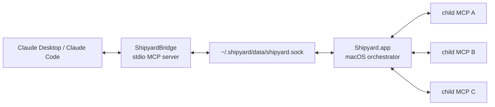

# Shipyard

Shipyard is a native macOS app for running and organizing multiple MCP servers behind one Claude-facing bridge. Claude talks to `ShipyardBridge` over stdio, the bridge talks to `Shipyard.app` over a local Unix socket, and Shipyard starts, stops, and routes requests to your child MCPs.

## Overview

- Native macOS SwiftUI app for MCP orchestration
- Single Claude connection instead of one config entry per child server
- Centralized runtime paths under `~/.shipyard/`
- JSON-based child server configuration in `~/.shipyard/config/mcps.json`
- Built-in logs, restart flow, and gateway discovery

## Architecture

More detail: [docs/explanation/architecture.md](docs/explanation/architecture.md)

## Installation

Shipyard supports two install paths:

1. Manual install: download `Shipyard.app`, launch it once, then point Claude Desktop or Claude Code at `~/.shipyard/bin/ShipyardBridge`.
2. Build from source: clone the repo, build with Xcode, run the app, and let it prepare `~/.shipyard/`.

Full instructions: [docs/how-to/install.md](docs/how-to/install.md)

## Quick Start

1. Install and launch Shipyard once so it creates `~/.shipyard/` and installs `ShipyardBridge`.
2. Add one child MCP to `~/.shipyard/config/mcps.json`.
3. Restart Shipyard or refresh its config.
4. Add one `shipyard` entry to Claude Desktop or Claude Code that runs `~/.shipyard/bin/ShipyardBridge`.
5. Open Claude and verify the child MCP tools appear through Shipyard.

A full walk-through with copy-paste examples lives in [docs/tutorial/getting-started.md](docs/tutorial/getting-started.md).

## Configuration

Shipyard keeps its runtime state in `~/.shipyard/`:

- `bin/ShipyardBridge`: the Claude-facing bridge binary
- `config/mcps.json`: child MCP definitions
- `data/shipyard.sock`: local socket between the bridge and app
- `logs/`: app, bridge, and child MCP logs

During local development, Shipyard uses `.shipyard-dev/` inside the repo instead of `~/.shipyard/`.

Reference: [docs/reference/config-format.md](docs/reference/config-format.md)

## Adding MCPs

Add child servers by editing `~/.shipyard/config/mcps.json`. Shipyard supports:

- stdio child MCPs with `command`, `args`, `cwd`, and `env`
- HTTP child MCPs with `url` and optional headers
- optional health-check, timeout, and disabled flags

Examples and step-by-step setup: [docs/how-to/add-mcp-server.md](docs/how-to/add-mcp-server.md)

## Troubleshooting

Start here if the bridge is not connecting, a child MCP will not start, or socket access fails:

- [docs/how-to/troubleshoot.md](docs/how-to/troubleshoot.md)
- [docs/how-to/monitor-logs.md](docs/how-to/monitor-logs.md)
- [docs/reference/socket-protocol.md](docs/reference/socket-protocol.md)

## Contributing

Contribution guidelines live in [CONTRIBUTING.md](CONTRIBUTING.md). Keep changes scoped, avoid machine-specific paths, and anchor non-trivial work to a Nightshift spec.
