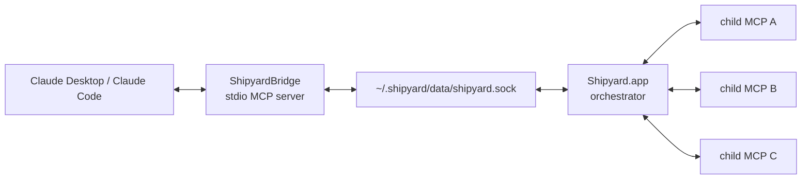

# Shipyard Architecture

## Overview

Shipyard is a native macOS SwiftUI app that orchestrates child MCP servers. Claude never connects to those child servers directly. Instead, Claude talks to `ShipyardBridge`, and the bridge forwards requests into the running app over a local Unix socket.

## Diagram



## Runtime Roles

### Claude Desktop or Claude Code

Your Claude client launches `ShipyardBridge` as a normal MCP server.

### ShipyardBridge

`ShipyardBridge` is the stdio-facing MCP binary. It:

- accepts MCP JSON-RPC from Claude
- connects to Shipyard over `~/.shipyard/data/shipyard.sock`
- exposes child MCP tools back to Claude through one bridge entry

### Shipyard.app

`Shipyard.app` is the orchestrator. It:

- reads `~/.shipyard/config/mcps.json`
- starts and stops child MCP processes
- maintains the local socket server
- aggregates tools from all enabled child MCPs
- records app, bridge, and child MCP logs

### Child MCPs

Child MCPs can use either:

- `stdio` transport, launched as local processes
- `http` transport, connected through a configured endpoint

## Request Flow

1. Claude calls a namespaced tool such as `filesystem__read_file`.
2. `ShipyardBridge` receives the MCP request on stdio.
3. The bridge forwards the request to `Shipyard.app` over the Unix socket.
4. Shipyard selects the correct child MCP and forwards the call.
5. The child MCP returns a result.
6. Shipyard sends the result back to the bridge.
7. The bridge returns a normal MCP response to Claude.

## Runtime Layout

Installed builds use:

```text
~/.shipyard/
├── bin/ShipyardBridge
├── config/mcps.json
├── data/shipyard.sock
└── logs/
```

Development builds use:

```text
<repo>/.shipyard-dev/
```

## Related Docs

- [install.md](../how-to/install.md)
- [config-format.md](../reference/config-format.md)
- [socket-protocol.md](../reference/socket-protocol.md)
